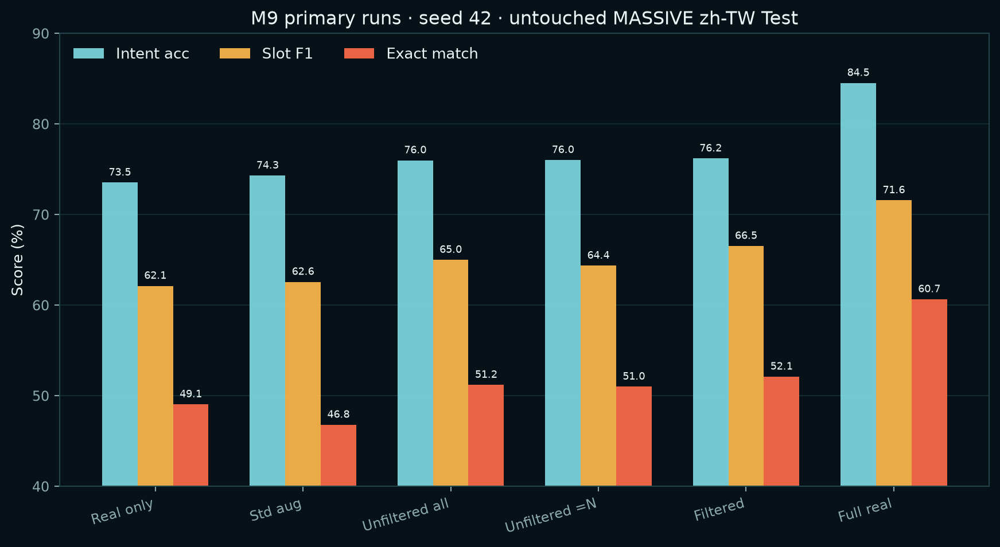
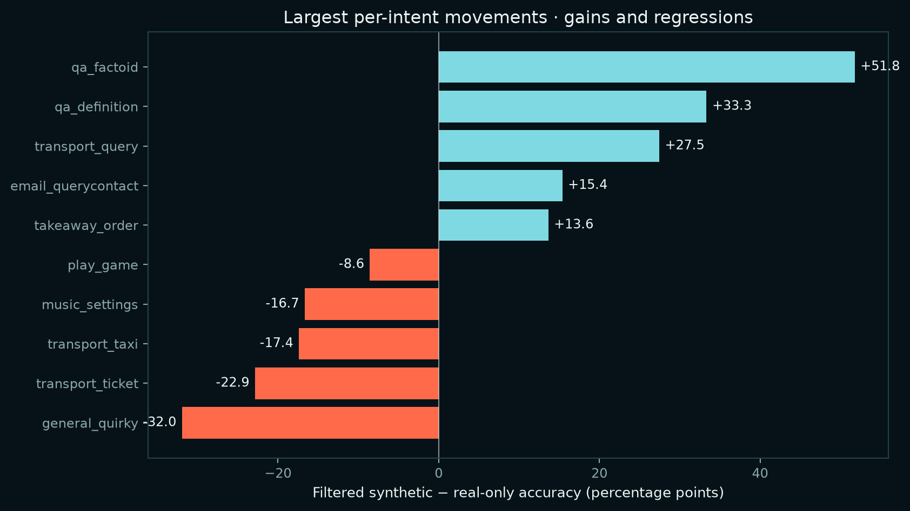
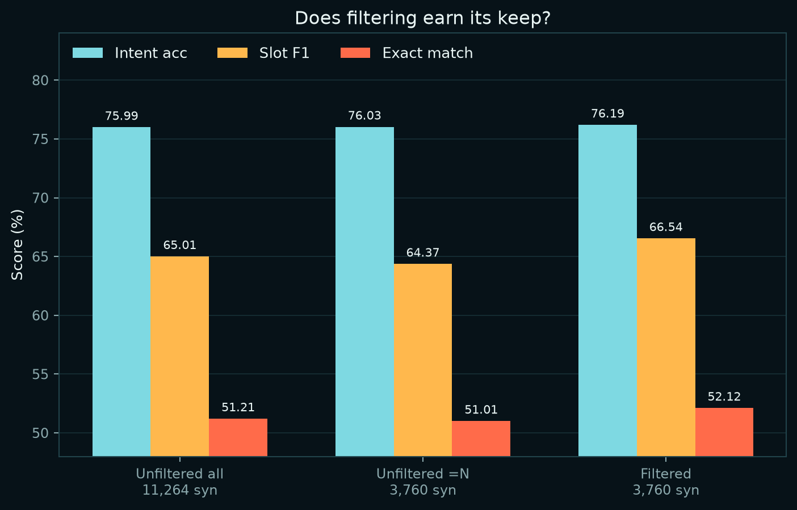
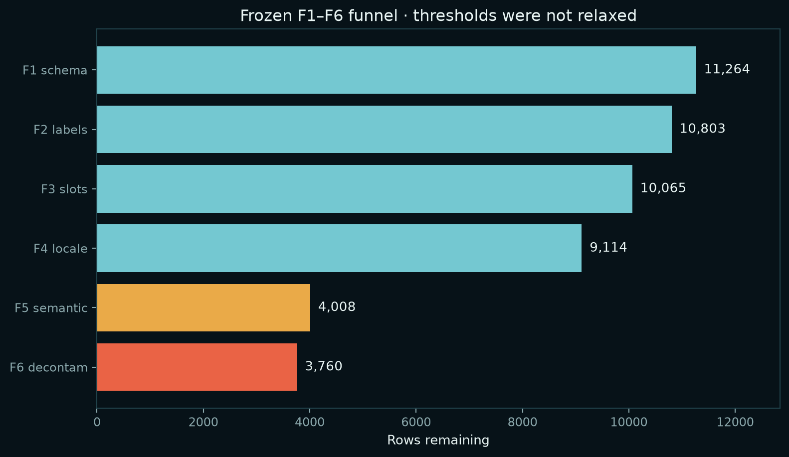
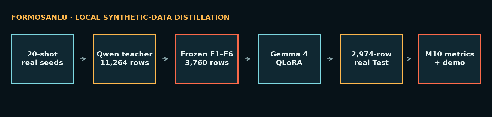

# FormosaNLU — 正體中文（台灣）NLU 的 Synthetic Data Distillation

> **目前狀態：**frozen corpus、M9 seed-42 primary 實驗矩陣與 seeds 43/44
> uncertainty runs、M10 評估、
> M11 比較介面、M12 報告產物、Colab portability 與 F7 independent
> judge audit、robustness inference 均已完成。所有本機 GPU 階段已收尾；
> GitHub、Hugging Face Dataset 與 LoRA adapter 已公開，並通過匿名下載驗證。
> **M15 已在第二個 student family（`microsoft/Phi-4-mini-instruct`）
> 完成同一份 paired contract 的複製，預先登記的判準通過。**

在 low-resource setting 下，由本機 LLM 生成的 synthetic data，能否改善小型
language model 的表現？FormosaNLU 以正體中文（台灣）口語理解測量這個問題，
任務包含 joint intent classification、slot filling，以及嚴格的 JSON output
contract。

| 項目 | 設定 |
| --- | --- |
| **Dataset** | MASSIVE `zh-TW`（CC BY 4.0），60 個 intents、55 種 slot types |
| **Low-resource setting** | 每個 intent 取 `min(20, available)` 筆 real train examples，seed 42 |
| **Teacher** | `qwen3.6:27b`，透過 Ollama 在本機執行 |
| **Student** | `google/gemma-4-E4B-it`，4-bit QLoRA |
| **Independent judge** | `gpt-oss:20b` |
| **Hardware / API spend** | 單張 RTX 4090 24 GB / **$0** |

Teacher、student 與 judge 來自不同 model families。Primary 結果使用
2,974 筆完全未進入訓練流程的 MASSIVE `zh-TW` Test rows。

## 公開產物

| Artifact | 位置 | 驗證狀態 |
| --- | --- | --- |
| Source、pipeline、reports | [GitHub](https://github.com/kuotunyu/FormosaNLU-Synth) | Public；Contributors 僅 `kuotunyu` |
| 3,754-row F1–F7 corpus | [Hugging Face Dataset](https://huggingface.co/datasets/steven0226/formosa-nlu-synth-v1) | Public；Dataset Viewer 與匿名載入通過 |
| Filtered seed-42 LoRA | [Hugging Face Model](https://huggingface.co/steven0226/gemma-4-e4b-formosanlu-lora) | Public；PEFT config、686 tensors 與 SHA-256 通過 |

```python
from datasets import load_dataset

dataset = load_dataset("steven0226/formosa-nlu-synth-v1")
print(dataset["train"].num_rows)  # 3754
```

LoRA adapter 使用方式與 Gemma 4 text-tower key mapping 已完整寫在
[Model Card](https://huggingface.co/steven0226/gemma-4-e4b-formosanlu-lora)。
匿名發布稽核結果保存在
[`reports/m13_publication.json`](reports/m13_publication.json)。

## TL;DR

在 seed 42 下，將 3,760 筆 filtered synthetic corpus 加入 20-shot real
baseline，使 exact match 提升 **+3.06%**（3.06 個百分點），補回與
full-real training 差距的 **26.4%**；slot F1 提升 4.40 個百分點，補回
46.6% 的差距。Filtered 組只使用約三分之一的 synthetic rows，表現仍優於
unfiltered-full 組。

三個 paired seeds（42–44）中，filtered 組相對 `real_only` 的 exact match
平均提升 **+3.86 ± 0.73 個百分點**（descriptive 95% CI
[+2.03, +5.68]），intent accuracy 平均提升 **+4.14 ± 1.39 個百分點**
（[+0.68, +7.59]）。由於只有三個 seeds，這些 intervals 是描述性不確定性，
不是廣泛統計顯著性宣稱。

**這個效果不只存在於一個 student family。** 以完全相同的 frozen corpus、
prompt、500 steps 與 strict evaluator，在第二個 family
`microsoft/Phi-4-mini-instruct` 重跑同一份三種子 paired contract 後，
intent accuracy 與 exact match 在兩個 family 都是正向平均提升，且
hierarchical 95% CI 下界都大於零——這正是**在看到 Phi 結果之前就凍結的
判準**。詳見下方「跨 student family 複製」。



## 實驗結果

### Seed-42 primary 實驗矩陣

| Group | Training data | intent acc | intent macro-F1 | slot F1 | exact match | JSON-valid |
| --- | --- | ---: | ---: | ---: | ---: | ---: |
| `zero_shot` | 未訓練 | 10.66% | 23.12% | 0.00% | 8.10% | 17.38% |
| `real_only` | 20-shot real | 73.54% | 75.20% | 62.14% | 49.06% | 98.02% |
| `real_std_aug` | + classical augmentation | 74.31% | 75.59% | 62.58% | 46.81% | 96.23% |
| `real_syn_unfiltered_full` | + 全部 unfiltered synthetic | 75.99% | 76.42% | 65.01% | 51.21% | 97.75% |
| `real_syn_unfiltered_eqn` | + equal-N unfiltered synthetic | 76.03% | 75.59% | 64.37% | 51.01% | 97.95% |
| `real_syn_filtered` | + filtered synthetic | 76.19% | 76.09% | 66.54% | 52.12% | 97.98% |
| `full_real` | 完整 MASSIVE train | 84.53% | 81.65% | 71.58% | 60.66% | 99.73% |

`zero_shot` 使用包含合法 intent／slot labels 的 frozen catalog prompt；
trained groups 使用不含 catalog 的 frozen SFT prompt。因此 zero-shot 是
deployment baseline，不是 prompt 完全相同的 ablation。

### 差距補回率

以 `real_only` 定義 0%、`full_real` 定義 100%，filtered synthetic primary
run 的變化如下：

| Metric | 相較 `real_only` 的絕對變化 | 差距補回率 |
| --- | ---: | ---: |
| Intent accuracy | +2.66 個百分點 | 24.2% |
| Intent macro-F1 | +0.89 個百分點 | 13.8% |
| Slot micro-F1 | +4.40 個百分點 | 46.6% |
| Exact match | +3.06 個百分點 | 26.4% |

### 三種子不確定性

`real_only` 與 `real_syn_filtered` 使用完全相同的 frozen data/config，分別在
seeds 42、43、44 訓練與評估；每個 run 都使用完整 2,974-row Test。

| Metric | real-only mean ± SD | filtered mean ± SD | paired Δ mean ± SD | paired Δ 95% CI |
| --- | ---: | ---: | ---: | ---: |
| Intent accuracy | 73.34% ± 0.32% | 77.47% ± 1.14% | +4.14% ± 1.39% | [+0.68%, +7.59%] |
| Intent macro-F1 | 74.55% ± 1.27% | 76.56% ± 0.41% | +2.01% ± 1.48% | [-1.67%, +5.70%] |
| Slot micro-F1 | 62.95% ± 1.18% | 65.86% ± 0.76% | +2.92% ± 1.92% | [-1.86%, +7.69%] |
| Exact match | 48.67% ± 0.65% | 52.52% ± 0.88% | +3.86% ± 0.73% | [+2.03%, +5.68%] |
| JSON-valid rate | 96.54% ± 2.01% | 98.11% ± 0.14% | +1.57% ± 2.02% | [-3.44%, +6.58%] |

95% intervals 使用 Student's t（df=2）；完整逐 seed 報告與原始統計在
[`reports/m9_replicate_summary.md`](reports/m9_replicate_summary.md)。

### Paired statistical evidence

另外使用 frozen row-level predictions 做 5,000 次 hierarchical paired
bootstrap：先重抽三個 training seeds，再於各 seed 內重抽相同 Test rows。
這保留了 adapter 間的逐列配對，也不把同一 Test row 在三個 seeds 的結果
誤當成九千筆獨立樣本。

| Metric | 平均提升 | Hierarchical bootstrap 95% CI |
| --- | ---: | ---: |
| Intent accuracy | +4.14 個百分點 | **[+2.60, +5.59]** |
| Intent macro-F1 | +2.01 個百分點 | **[+0.35, +3.69]** |
| Slot micro-F1 | +2.92 個百分點 | **[+0.87, +4.68]** |
| Exact match | +3.86 個百分點 | **[+2.75, +4.92]** |

Intent accuracy 與 exact match 另在每個 seed 執行 two-sided exact McNemar
test；六項比較經 Holm correction 後全部 `p ≤ 0.00017`。這是 frozen
MASSIVE `zh-TW` Test 與目前 Gemma 4 contract 內的 paired evidence，不等同
跨模型或跨資料集泛化。完整方法、input SHA-256 與結果見
[`reports/m14_paired_statistics.md`](reports/m14_paired_statistics.md)。

### 跨 student family 複製

單一 student 上的提升，可能只是那個 model 的特性。為了排除這個解釋，M15 用
第二個 student family 重跑**完全相同**的 paired contract：同一份 frozen
corpus、同一個 prompt template、500 steps、相同 seeds 與相同 strict
evaluator，只換 base model。

判準在**看到任何 Phi 結果之前**就凍結：

> 對 `intent_accuracy` 與 `exact_match` 兩項，paired mean delta 在每個
> family 都必須為正，且各自的 hierarchical 95% CI 下界都必須大於零。

| Metric | Gemma Δ [95% CI] | Phi Δ [95% CI] | 兩個 family 的 CI 都 > 0 |
| --- | ---: | ---: | :---: |
| `intent_accuracy` | +4.14 [+2.60, +5.59] | +5.09 [+1.83, +9.02] | ✅ |
| `intent_macro_f1` | +2.01 [+0.35, +3.69] | +3.36 [+0.98, +5.56] | ✅ |
| `slot_micro_f1` | +2.92 [+0.87, +4.68] | +1.80 [+0.29, +3.19] | ✅ |
| `exact_match` | +3.86 [+2.75, +4.92] | +4.71 [+1.36, +7.59] | ✅ |
| `json_valid_rate` | +1.57 [-0.01, +3.77] | +1.77 [+1.05, +2.63] | ❌ |

兩項預先登記的 primary metrics 都通過，因此結論為
`replicated_across_student_families`。

**未達標的部分照實列出**：`json_valid_rate` 沒有通過同一條門檻，因為 Gemma
側的 CI 跨越零；它不在預先登記的判準內，但不會因此被略過。Phi 的
`exact_match_seed_42` 在 Holm 校正後 `p = 0.141` 不顯著，另外五項 paired
tests 顯著。

**範圍**：這是兩個 family、一份 frozen dataset、一種 training contract 的
複製。兩個 family 分別彙總，**不 pooling**，也不宣稱推廣到其他 dataset、
其他任務或任意 model。完整方法與逐 seed 數字見
[`reports/m15_cross_model_replication.md`](reports/m15_cross_model_replication.md)
與
[`reports/m15_phi4mini_paired_statistics.md`](reports/m15_phi4mini_paired_statistics.md)。

### 各 intent 的變化

進步最多的是 `qa_factoid`（+51.77 個百分點）、`qa_definition`（+33.33）
與 `transport_query`（+27.45）。退步最多的是 `general_quirky`（-31.95）、
`transport_ticket`（-22.86）與 `transport_taxi`（-17.39）。

Synthetic data 並未改善所有 intents，因此進步與退步都必須呈現。



## Filter pipeline 是否真的有價值？

三個 synthetic groups 用來區分 data quality 與 quantity：

- 相較使用全部 11,264 筆資料的 unfiltered-full，3,760-row filtered corpus
  的 intent accuracy 高 0.20、slot F1 高 1.53、exact match 高 0.91 個百分點。
- 相較 equal-N unfiltered control，filtered corpus 的 intent accuracy 高
  0.17、slot F1 高 2.17、exact match 高 1.11 個百分點。

在 seed 42 的結果中，filter pipeline 帶來的改善不只是 training rows 數量不同。



### Filter funnel

預先登記的 8,000–9,000 accepted-row 目標沒有達成。Frozen F1–F6 最終保留
3,760 / 11,264 筆（33.38%）；看到結果後沒有放寬 thresholds。

| Stage | 移除 | 剩餘 |
| --- | ---: | ---: |
| Generated / F1 schema | 0 | 11,264 |
| F2 label contract | 461 | 10,803 |
| F3 grounded slots | 738 | 10,065 |
| F4 Taiwan locale/language | 951 | 9,114 |
| F5 seed copy / synthetic duplicate / outlier | 5,106 | 4,008 |
| F6 Val/Test contamination exclusion | 248 | **3,760** |
| F7 sampled judge exclusions（376-row audit） | 6 | **3,754 release rows** |



最大宗損失是 4,596 筆 synthetic near-duplicates。9,114 筆 F1–F4 survivors
中，只有 4,044 個 utterances 在 exact-text 層級不重複。這種 corpus-scale
mode collapse 在 500-row pilot 中並不明顯，因此被保留為重要的 negative
result，而不是隱藏或事後調整門檻。

F7 依事先固定的 strata 稽核 376 筆，370 筆通過、6 筆拒絕。只有 50 筆
random stratum 可用來估計 F1–F6 漏檢率：其中 3 筆被拒絕，觀察值為
**6.0%**（Wilson 95% interval：2.06%–16.22%）；hard-negative 與
boundary-conflict 是刻意加權的 targeted strata，不能當作全 corpus 的
無偏估計。6 筆已由 release-only corpus 排除，留下 3,754 筆；M9 的
frozen 3,760-row training contract 不回溯修改。

## 成本與可重現性

Primary GPU path 在單張 RTX 4090 上共使用 **14.440 h**：

| Phase | GPU wall-clock | 證據 |
| --- | ---: | --- |
| Synthetic generation | **4.073 h** | `reports/generation_report.json` |
| Primary training，seed 42 | **6.540 h** | `runs/m9_batch_report.json` 的六個 runs |
| Trained evaluation，seed 42 | **2.777 h** | `results/m9_eval_batch_report.json` 的六個 runs |
| Zero-shot evaluation | **1.050 h** | M8 report 的 generation timing |
| **Measured primary core total** | **14.440 h** | 不含 extra seeds、F7 與 robustness |
| F7 independent judge（auxiliary） | **0.756 h** | 376 筆逐列 model latency 加總 |
| M11 real demo（auxiliary） | **0.010 h** | 10 次 generation latency 加總 |
| Extra-seed training，seeds 43/44（auxiliary） | **4.188 h** | 四個 frozen-config runs |
| Extra-seed evaluation，seeds 43/44（auxiliary） | **1.630 h** | 四個完整 2,974-row Test runs |
| Robustness probe inference（auxiliary） | **2.102 h** | 兩組 × 8,922-row evaluation-only runs |
| **Measured auxiliary subtotal** | **8.685 h** | F7 + M11 + extra seeds + robustness |
| **可追溯 local total** | **23.124 h** | 所有本機 GPU 階段 |
| **API spend** | **$0** | 所有 model workloads 均在本機執行 |

若以 RTX 4090 的 450 W TDP 計算，primary core 14.440 小時對應
6.498 kWh、local total 23.124 小時對應 10.406 kWh 的保守
GPU-only 上限。這不是 wall-socket measurement，也不代表 GPU 全程以
TDP 運作。

資源帳本位於
[`reports/m12_resource_ledger.json`](reports/m12_resource_ledger.json)，
可使用下列命令重建圖表並驗證 README：

```bash
python -m scripts.build_m12_artifacts
python -m scripts.verify_readme
```

## Robustness probe

Auxiliary perturbation manifest 含 8,922 筆 rows，涵蓋 typo、code-switching
與 ASR-like noise。兩個 seed-42 adapters 各完成 8,922-row inference；
它是 auxiliary evaluation，不取代 untouched Test 的 headline table，也不
回流 training。

| Group | Probe | Intent acc | Slot F1 | Exact match | JSON valid |
| --- | --- | ---: | ---: | ---: | ---: |
| `real_only` | `asr_noise` | 68.49% | 58.62% | 42.54% | 98.52% |
| `real_only` | `colloquial` | 73.50% | 61.20% | 47.98% | 98.18% |
| `real_only` | `lexical` | 72.83% | 61.97% | 48.49% | 97.98% |
| `real_syn_filtered` | `asr_noise` | 70.24% | 61.25% | 44.08% | 97.88% |
| `real_syn_filtered` | `colloquial` | 74.88% | 65.69% | 51.18% | 97.68% |
| `real_syn_filtered` | `lexical` | 74.68% | 65.48% | 51.11% | 97.98% |

ASR-like noise 對兩組都最具挑戰。Filtered adapter 在三種 probes 的 intent
accuracy、slot F1 與 exact match 都高於 `real_only`；差距並非只存在於
untouched Test。不過 robustness 只使用 seed 42，而且擾動是 deterministic
evaluation probes，不等同真實語音辨識錯誤分布。

## 方法



### Generation recipes

| Recipe | 用途 |
| --- | --- |
| `paraphrase` | 保留 labels 的 seed utterance 改寫 |
| `slot_substitution` | 先由程式替換台灣在地 slot value，再做受限制的自然語言改寫 |
| `noise_codeswitch` | Code-switching、typo、spoken particles 與 ASR-like noise，且不得破壞 slot span |
| `hard_negative` | 建立容易混淆 intents 之間的 minimal pairs |

Labels 由 pipeline 自動產生，沒有逐筆人工標註。人工僅 spot-check 20 筆。
Frozen semantic thresholds 如下：

- synthetic duplicate：0.999
- seed copy：0.995
- outlier：0.650
- Val/Test contamination：0.990

完整設計請見 [`docs/DESIGN.md`](docs/DESIGN.md)。

### 互動式比較介面

M11 提供同一句輸入的 base model 與 filtered-adapter 並排比較。Real runtime
只載入一份 4-bit Gemma model，再切換 LoRA adapter，避免同時載入兩份 model。
固定五句的本機 RTX 4090 evidence 已完成：在相同 unconstrained decoding
contract 下，base model 0/5 通過嚴格 schema，filtered adapter
則為 5/5 valid JSON。這是小型質性示範，不是 accuracy estimate；原始輸出、
latency、adapter tree SHA-256 與 source commit 都保存在
[`reports/m11_demo_evidence.json`](reports/m11_demo_evidence.json)。

```bash
uv sync --extra demo
python -m scripts.demo
```

若只想驗證 UI，不載入 model weights：

```bash
python -m scripts.demo --mock
```

## 重現流程

> 執行環境：native Windows、單張 RTX 4090，不需要 WSL。

```bash
# 1. 建立環境
uv sync --extra demo
python -m scripts.check_env

# 2. 建立或驗證 split manifest
python -m src.data.freeze_split
python -m src.data.freeze_split --verify

# 3. 產生 frozen corpus
python -m src.synthetic.generate --pilot 500
python -m src.synthetic.generate --full 11264

# 4. 套用 frozen F1-F6 filters
python -m src.filtering.run \
  --input data/generated/full_unfiltered.jsonl \
  --accepted data/filtered/full_f1_f4.jsonl \
  --rejected data/filtered/full_rejected_f1_f4.jsonl \
  --report reports/m6_cheap_filter_funnel.json
python -m src.filtering.embed_full --batch-size 64
python -m src.filtering.apply_semantic \
  --input data/filtered/full_f1_f4.jsonl \
  --cheap-report reports/m6_cheap_filter_funnel.json \
  --embeddings data/embeddings/m6_full_bge_m3.npz \
  --accepted data/filtered/full_f1_f6.jsonl \
  --rejected data/filtered/full_rejected_f5_f6.jsonl \
  --exclusions data/filtered/full_f6_exclusions.jsonl \
  --report reports/m6_full_filter_funnel.json

# 5. 準備、驗證、訓練與評估 primary runs
python -m scripts.prepare_m9_data
python -m scripts.train_all --validate-inputs
python -m scripts.m9_overnight
python -m scripts.m9_overnight --execute --confirm M9-OVERNIGHT-3760-4090
python -m scripts.eval --execute --confirm M9-EVAL-LOCAL-4090
python -m scripts.report_results

# 6. 重建並驗證 M12
python -m scripts.build_m12_artifacts
python -m scripts.verify_readme

# 7. 重建 F7 release-only corpus，並查看 three-seed plan（CPU-only）
python -m scripts.finalize_f7_release
python -m scripts.judge_full
python -m scripts.m9_replicates

# 以下命令只能在 sibling/GPU safety gates 全綠後執行
python -m scripts.judge_full --execute --confirm F7-GPT-OSS-20B
python -m scripts.capture_demo_evidence \
  --execute --confirm M11-DEMO-EVIDENCE-4090
python -m scripts.m9_replicates \
  --execute --confirm M9-REPLICATES-43-44-4090
python -m scripts.eval_robustness \
  --execute --confirm M10-ROBUSTNESS-8922-4090
```

Colab notebook
[`notebooks/01_sft_student.ipynb`](notebooks/01_sft_student.ipynb) 使用相同
training code。Bundle、GPU-memory preflight、每兩分鐘 Drive checkpoint
sync 與 resume path 已實際通過 one-group portability run：`real_only`
seed 42 在 G4（NVIDIA RTX PRO 6000 Blackwell）完成 500 steps，training
runtime 1,914.7 秒，peak allocated VRAM 20,646 MiB。frozen config、資料筆數、
參數量與本機 primary contract 全部一致；稽核證據見
[`reports/m9_colab_portability.json`](reports/m9_colab_portability.json)。

## Leakage 與 contamination 聲明

- Generator 從未讀取 validation 或 Test examples；seeds 只來自 frozen
  20-shot train manifest。
- Validation 與 Test 永遠是 real data，不進入 training。
- 對 Val/Test 的 decontamination 僅做 exclusion：移除 near-duplicates，
  Val/Test 從未用於 ranking、weighting 或挑選 training samples。
- Robustness probe 只用於 evaluation，絕不回流 training。
- Split manifest、seed 與 source hashes 記錄於
  [`splits/manifest.json`](splits/manifest.json)。

## 限制

- Training-seed 摘要只有 `n=3`；M14 hierarchical bootstrap 與 paired
  McNemar tests 強化了 frozen Test 上的證據，但不支撐跨資料集泛化宣稱。
- M15 的複製只涵蓋**兩個** student families，且共用同一份 frozen corpus、
  同一種 training contract 與同一個 Test set。兩個 family 分別彙總、不
  pooling。「在兩個 family 上複製成功」不等於「對任意 model 都成立」，
  也不等於在其他任務或其他資料集上成立。
- `json_valid_rate` 未通過 M15 的兩 family CI 門檻（Gemma 側 CI 跨越零），
  Phi 的 `exact_match_seed_42` 在 Holm 校正後也不顯著。這兩項都不在預先
  登記的判準內，但一併列出。
- F7 independent judge audit 已完成 376/376；random stratum 的觀察漏檢率
  為 6.0%，但樣本僅 50 筆，95% interval 很寬。
- Robustness 只比較 seed-42 adapters，且三種擾動是 deterministic probes；
  尚未涵蓋真實 ASR log、自然 code-switching corpus 或跨 seed robustness。
- M11 的五句 real-runtime comparison 只證明 demo contract 與 adapter 可實際
  執行；它是 curated qualitative evidence，不可當成 Test-set 成效。
- 未執行 per-recipe ablation，因此不做單一 recipe 的 causal claim。
- MASSIVE `zh-TW` 翻譯自 English SLURP，未必涵蓋自然台灣口語的完整分布。
- Synthetic data 會繼承 teacher 的 biases 與台灣在地知識缺口。
- F5 移除 4,596 筆 synthetic near-duplicates，顯示明顯的 generator mode
  collapse。

## 授權

| Artifact | License |
| --- | --- |
| 本 repository 的 code | MIT（[LICENSE](LICENSE)） |
| MASSIVE `zh-TW` seed data | CC BY 4.0 |
| Teacher、judge 與 student weights | Apache-2.0；詳見各 upstream model card |
| Synthetic dataset | 詳見 [`docs/data_card.md`](docs/data_card.md) |
| LoRA adapter | Apache-2.0，沿用 student base model |

## Roadmap

M13 public release、M14 paired statistics 與 **M15 跨 family 複製均已完成**。
M15 使用 `microsoft/Phi-4-mini-instruct`（MIT，frozen revision
`cfbefacb99257ffa30c83adab238a50856ac3083`）重複
`real_only`／`real_syn_filtered` 三種子 paired contract；跨 family claim
在看到結果前就限定為 intent accuracy 與 exact match 在兩個 model families
都呈正向 paired mean，且 hierarchical 95% CI lower bound 都大於零。
該判準已通過，結果見上方「跨 student family 複製」。

M15 原始 2-step smoke 的 strict label gate 為失敗（strict JSON-valid
`0/32`），但 `32/32` 輸出均為可解析 JSON object，checkpoint-1、跨程序
resume 至 checkpoint-2、32-row evaluation 與 6,674 MiB peak reserved VRAM
皆正常。正式六組開始前已登錄
[`m15.smoke.infrastructure.v2`](reports/m15_smoke_protocol_amendment.json)
protocol amendment：smoke 僅判定 infrastructure 與頂層 JSON 結構；
unknown intent、slot schema、accuracy 與 exact match 仍依原 strict evaluator
計分。原始失敗證據保留於
[`reports/m15_phi4mini_smoke.json`](reports/m15_phi4mini_smoke.json)，沒有
parser repair、label aliasing，也沒有變更正式 500-step contract。

後續再延伸台灣在地知識 distillation，並以 TMMLU+ 與 `twinkle-eval`
等工具評估。

## 專案文件

| 文件 | 用途 |
| --- | --- |
| [`docs/DESIGN.md`](docs/DESIGN.md) | Data pipeline 設計 |
| [`docs/DESIGN_PHASE2.md`](docs/DESIGN_PHASE2.md) | Training、evaluation、demo 與 release 設計 |
| [`docs/DECISIONS.md`](docs/DECISIONS.md) | ADR-style decision log |
| [`docs/teacher_choice.md`](docs/teacher_choice.md) | Model 選擇與授權分析 |
| [`docs/data_card.md`](docs/data_card.md) | Synthetic dataset card |
| [`hf_cards/`](hf_cards) | Hugging Face Dataset／Model Cards |
| [`docs/instructions_for_me.md`](docs/instructions_for_me.md) | Colab、Hugging Face 與 GitHub 操作紀錄 |
