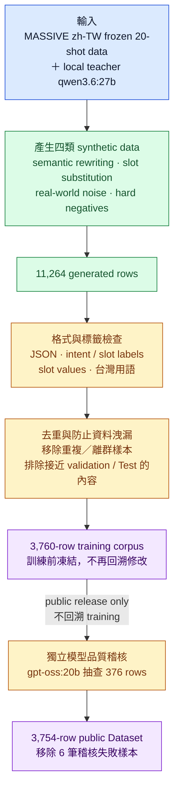
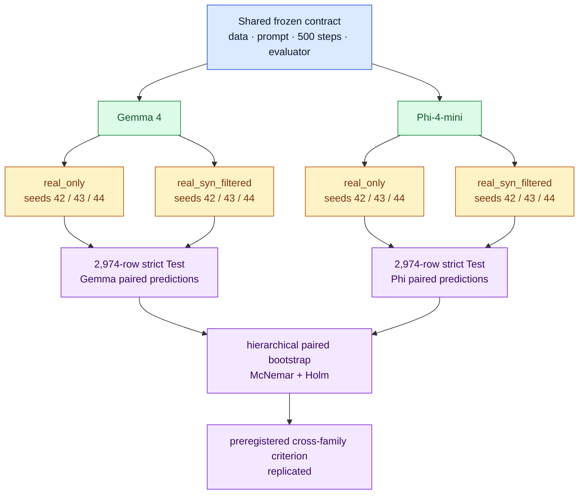

# FormosaNLU — Synthetic Data Distillation for Low-resource NLU

[](https://github.com/kuotunyu/FormosaNLU-Synth/releases/tag/v1.2.1)
[](https://huggingface.co/datasets/steven0226/formosa-nlu-synth-v1)
[](https://huggingface.co/steven0226/gemma-4-e4b-formosanlu-lora)
[](https://doi.org/10.5281/zenodo.21767493)
[](LICENSE)

以本機 open-weight teacher 生成、過濾 synthetic data，再於 20-shot MASSIVE
`zh-TW` 上驗證它能否改善 intent classification、slot filling 與 strict JSON
output。效果已在 Gemma 與 Phi-4-mini 兩個 student model families 上，以相同的
paired contract 完成複製。

| 核心證據 | 結果 |
| --- | --- |
| **Gemma，3 paired seeds** | intent accuracy **+4.14 pp**；joint exact match **+3.86 pp** |
| **Phi-4-mini replication** | intent accuracy **+5.09 pp**；joint exact match **+4.71 pp** |
| **Local-first pipeline** | **11,264** generated → **3,760** frozen primary；單張 RTX 4090；**$0 API spend** |


> **專案已完成。** GitHub、Hugging Face Dataset、Gemma LoRA adapter 與
> Zenodo source archive 均已公開，並通過匿名下載、hash 與 citation 驗證。

## 公開產物

| Artifact | 位置 | 驗證狀態 |
| --- | --- | --- |
| Source、pipeline、reports | [GitHub](https://github.com/kuotunyu/FormosaNLU-Synth) | Public；Contributors 僅 `kuotunyu` |
| v1.2.1 immutable source archive | [Zenodo](https://zenodo.org/records/21767493) | Public；version DOI [`10.5281/zenodo.21767493`](https://doi.org/10.5281/zenodo.21767493) |
| 3,754-row F1–F7 corpus | [Hugging Face Dataset](https://huggingface.co/datasets/steven0226/formosa-nlu-synth-v1) | Public；Dataset Viewer 與匿名載入通過 |
| Filtered seed-42 LoRA | [Hugging Face Model](https://huggingface.co/steven0226/gemma-4-e4b-formosanlu-lora) | Public；PEFT config、686 tensors 與 SHA-256 通過 |

```python
from datasets import load_dataset

dataset = load_dataset("steven0226/formosa-nlu-synth-v1")
print(dataset["train"].num_rows)  # 3754
```

LoRA 使用方式見 [Model Card](https://huggingface.co/steven0226/gemma-4-e4b-formosanlu-lora)；匿名發布稽核見 [`m13_publication.json`](reports/m13_publication.json)。

## 這個模型實際在做什麼

以下是同一台 RTX 4090、同一份 decoding contract 的**真實輸出**。

**輸入：`播放周杰倫`**

```jsonc
// base model — 意圖正確，但鍵名用了 "slot"
{"intent": "play_music", "slots": [{"slot": "artist_name", "value": "周杰倫"}]}

// filtered adapter
{"intent":"play_music","slots":[{"type":"artist_name","value":"周杰倫"}]}
```

同一組五句中，**base model 0/5**，adapter 則是 **5/5 valid JSON**；差別不只在 intent，也在能否穩定遵守 schema。

<details>
<summary><strong>查看第二個輸出與比較邊界</strong></summary>

**輸入：`台北明天會不會下雨`**

```json
{"intent":"weather_query","slots":[{"type":"place_name","value":"台北"},{"type":"date","value":"明天"}]}
```

Adapter 也把 base 誤判為 `timeofday` 的「明天」修正為 `date`。兩邊 prompt 刻意不同：base 使用含合法 labels 的 zero-shot catalog prompt，adapter 使用 frozen SFT prompt；這是部署情境比較，不是同 prompt ablation，也不是 Test-set 成效。

</details>

完整五句、latency 與 adapter tree SHA-256 見 [`m11_demo_evidence.json`](reports/m11_demo_evidence.json)。

## 方法總覽

實驗使用 MASSIVE `zh-TW`（60 intents、55 slot types）的 frozen 20-shot split；`qwen3.6:27b` teacher、`google/gemma-4-E4B-it`／`microsoft/Phi-4-mini-instruct` QLoRA students 與 `gpt-oss:20b` judge 分屬不同 model families。所有 primary results 均來自未進入訓練的 2,974-row Test；本機 RTX 4090 執行，API spend **$0**。

### 資料產製與品質控管



<details>
<summary><strong>F1–F7 是什麼？</strong></summary>

主圖使用白話名稱；reports 與程式碼則以以下 audit IDs 追蹤每筆資料：

| Audit ID | 實際檢查內容 |
| --- | --- |
| F1 | JSON 可解析、欄位與型別正確 |
| F2 | intent 與 slot labels 屬於 frozen label set |
| F3 | slot values 確實出現在句子中 |
| F4 | 繁體中文與台灣用語符合規則 |
| F5 | 去除重複、過近與極端離群樣本 |
| F6 | 排除接近 validation / Test 的內容，只用於刪除、不用於挑選 |
| F7 | 不同 model family 的獨立抽樣稽核，只影響公開 Dataset |

完整 thresholds 與拒絕碼見 [`docs/DESIGN.md`](docs/DESIGN.md)。

</details>

### 成對實驗與跨模型驗證



<details>
<summary><strong>查看 publication static pipeline figure</strong></summary>

</details>

<details>
<summary><strong>執行互動式 base / adapter 比較介面</strong></summary>

```bash
uv sync --extra demo
python -m scripts.demo       # real model
python -m scripts.demo --mock
```

</details>

## 實驗結果

<details>
<summary><strong>查看 seed-42 primary matrix 與差距補回率</strong></summary>

### Seed-42 primary 實驗矩陣

| Group | Training data | intent acc | intent macro-F1 | slot F1 | exact match | JSON-valid |
| --- | --- | ---: | ---: | ---: | ---: | ---: |
| `zero_shot` | 未訓練 | 10.66% | 23.12% | 0.00% | 8.10% | 17.38% |
| `real_only` | 20-shot real | 73.54% | 75.20% | 62.14% | 49.06% | 98.02% |
| `real_std_aug` | + classical augmentation | 74.31% | 75.59% | 62.58% | 46.81% | 96.23% |
| `real_syn_unfiltered_full` | + 全部 unfiltered synthetic | 75.99% | 76.42% | 65.01% | 51.21% | 97.75% |
| `real_syn_unfiltered_eqn` | + equal-N unfiltered synthetic | 76.03% | 75.59% | 64.37% | 51.01% | 97.95% |
| `real_syn_filtered` | + filtered synthetic | 76.19% | 76.09% | 66.54% | 52.12% | 97.98% |
| `full_real` | 完整 MASSIVE train | 84.53% | 81.65% | 71.58% | 60.66% | 99.73% |

`zero_shot` 使用包含合法 intent／slot labels 的 frozen catalog prompt；
trained groups 使用不含 catalog 的 frozen SFT prompt。因此 zero-shot 是
deployment baseline，不是 prompt 完全相同的 ablation。

### 差距補回率

以 `real_only` 定義 0%、`full_real` 定義 100%，filtered synthetic primary
run 的變化如下：

| Metric | 相較 `real_only` 的絕對變化 | 差距補回率 |
| --- | ---: | ---: |
| Intent accuracy | +2.66 個百分點 | 24.2% |
| Intent macro-F1 | +0.89 個百分點 | 13.8% |
| Slot micro-F1 | +4.40 個百分點 | 46.6% |
| Exact match | +3.06%（3.06 個百分點） | 26.4% |

</details>

### 三種子不確定性

`real_only` 與 `real_syn_filtered` 使用完全相同的 frozen data/config，分別在
seeds 42、43、44 訓練與評估；每個 run 都使用完整 2,974-row Test。

| Metric | real-only mean ± SD | filtered mean ± SD | paired Δ mean ± SD | paired Δ 95% CI |
| --- | ---: | ---: | ---: | ---: |
| Intent accuracy | 73.34% ± 0.32% | 77.47% ± 1.14% | +4.14% ± 1.39% | [+0.68%, +7.59%] |
| Intent macro-F1 | 74.55% ± 1.27% | 76.56% ± 0.41% | +2.01% ± 1.48% | [-1.67%, +5.70%] |
| Slot micro-F1 | 62.95% ± 1.18% | 65.86% ± 0.76% | +2.92% ± 1.92% | [-1.86%, +7.69%] |
| Exact match | 48.67% ± 0.65% | 52.52% ± 0.88% | +3.86% ± 0.73% | [+2.03%, +5.68%] |
| JSON-valid rate | 96.54% ± 2.01% | 98.11% ± 0.14% | +1.57% ± 2.02% | [-3.44%, +6.58%] |

95% intervals 使用 Student's t（df=2）；完整逐 seed 報告與原始統計在
[`reports/m9_replicate_summary.md`](reports/m9_replicate_summary.md)。

### Paired statistical evidence

另外使用 frozen row-level predictions 做 5,000 次 hierarchical paired
bootstrap：先重抽三個 training seeds，再於各 seed 內重抽相同 Test rows。
這保留了 adapter 間的逐列配對，也不把同一 Test row 在三個 seeds 的結果
誤當成九千筆獨立樣本。

| Metric | 平均提升 | Hierarchical bootstrap 95% CI |
| --- | ---: | ---: |
| Intent accuracy | +4.14 個百分點 | **[+2.60, +5.59]** |
| Intent macro-F1 | +2.01 個百分點 | **[+0.35, +3.69]** |
| Slot micro-F1 | +2.92 個百分點 | **[+0.87, +4.68]** |
| Exact match | +3.86 個百分點 | **[+2.75, +4.92]** |

Intent accuracy 與 exact match 另在每個 seed 執行 two-sided exact McNemar
test；六項比較經 Holm correction 後全部 `p ≤ 0.00017`。這是 frozen
MASSIVE `zh-TW` Test 與目前 Gemma 4 contract 內的 paired evidence，不等同
跨模型或跨資料集泛化。完整方法、input SHA-256 與結果見
[`reports/m14_paired_statistics.md`](reports/m14_paired_statistics.md)。

<details>
<summary><strong>查看 M19 equal-N per-recipe ablation（negative result）</strong></summary>

### Equal-N per-recipe ablation（M19）

M19 把四種 synthetic recipes 做 leave-one-out，並將每組 synthetic rows 固定為
2,246 筆；連同相同的 1,176 筆 real examples，每組訓練資料都是 3,422 筆。
因此下表比較的是 **composition**，不是資料量。這是 seed 42（n=1）的描述性
比較；預先登記的 detectability metric 是 exact match，門檻為
**2.5 percentage points**。

| Group | 排除的 recipe | intent acc | intent macro-F1 | slot F1 | exact match | exact Δ vs control（pp） | JSON-valid | 達門檻 |
| --- | --- | ---: | ---: | ---: | ---: | ---: | ---: | :---: |
| `abl_all_eqn` | `— (equal-N control)` | 75.99% | 75.51% | 63.61% | 49.50% | +0.00 | 97.34% | no |
| `abl_no_paraphrase` | `paraphrase` | 74.14% | 74.72% | 64.09% | 50.00% | +0.50 | 96.54% | no |
| `abl_no_slot_substitution` | `slot_substitution` | 77.14% | 77.11% | 65.60% | 51.51% | +2.02 | 96.40% | no |
| `abl_no_noise_codeswitch` | `noise_codeswitch` | 73.47% | 73.03% | 63.84% | 48.76% | -0.74 | 96.47% | no |
| `abl_no_hard_negative` | `hard_negative` | 76.19% | 76.23% | 64.69% | 50.81% | +1.31 | 97.24% | no |

五個組別都完成 500-step training 與 2,974-row strict evaluation；最大 absolute
exact-match delta 是移除 `slot_substitution` 的 +2.02 points，仍低於 2.5-point
門檻。因此結論是
`no_difference_reaches_preregistered_detectability_threshold`：這份結果沒有辨識出
任何單一 recipe 的可檢出獨立貢獻，也**不做單一 recipe 的 causal claim**。
Machine-readable 結果、執行契約與逐組報告分別在
[`reports/m19_ablation.json`](reports/m19_ablation.json)、
[`docs/M19_ABLATION_PROTOCOL.md`](docs/M19_ABLATION_PROTOCOL.md) 與
[`reports/m19/`](reports/m19/)；這個 negative result 連同 single-seed 限制完整保留。

</details>

### 跨 student family 複製

單一 student 上的提升，可能只是那個 model 的特性。為了排除這個解釋，M15 用
第二個 student family 重跑**完全相同**的 paired contract：同一份 frozen
corpus、同一個 prompt template、500 steps、相同 seeds 與相同 strict
evaluator，只換 base model。

判準在**看到任何 Phi 結果之前**就凍結：

> 對 `intent_accuracy` 與 `exact_match` 兩項，paired mean delta 在每個
> family 都必須為正，且各自的 hierarchical 95% CI 下界都必須大於零。

| Metric | Gemma Δ [95% CI] | Phi Δ [95% CI] | 兩個 family 的 CI 都 > 0 |
| --- | ---: | ---: | :---: |
| `intent_accuracy` | +4.14 [+2.60, +5.59] | +5.09 [+1.83, +9.02] | ✅ |
| `intent_macro_f1` | +2.01 [+0.35, +3.69] | +3.36 [+0.98, +5.56] | ✅ |
| `slot_micro_f1` | +2.92 [+0.87, +4.68] | +1.80 [+0.29, +3.19] | ✅ |
| `exact_match` | +3.86 [+2.75, +4.92] | +4.71 [+1.36, +7.59] | ✅ |
| `json_valid_rate` | +1.57 [-0.01, +3.77] | +1.77 [+1.05, +2.63] | ❌ |

兩項預先登記的 primary metrics 都通過，因此結論為
`replicated_across_student_families`。

**未達標的部分照實列出**：`json_valid_rate` 沒有通過同一條門檻，因為 Gemma
側的 CI 跨越零；它不在預先登記的判準內，但不會因此被略過。Phi 的
`exact_match_seed_42` 在 Holm 校正後 `p = 0.141` 不顯著，另外五項 paired
tests 顯著。

**範圍**：這是兩個 family、一份 frozen dataset、一種 training contract 的
複製。兩個 family 分別彙總，**不 pooling**，也不宣稱推廣到其他 dataset、
其他任務或任意 model。完整方法與逐 seed 數字見
[`reports/m15_cross_model_replication.md`](reports/m15_cross_model_replication.md)
與
[`reports/m15_phi4mini_paired_statistics.md`](reports/m15_phi4mini_paired_statistics.md)。

<details>
<summary><strong>查看各 intent 的完整變化與 seed variance</strong></summary>

### 各 intent 的變化

在 seed 42 上，進步最多的是 `qa_factoid`（+51.77 個百分點）、`qa_definition`
（+33.33）與 `transport_query`（+27.45）；退步最多的是 `general_quirky`
（-31.95）、`transport_ticket`（-22.86）與 `transport_taxi`（-17.39）。


#### ⚠️ 但這些極端值大多是種子變異，不是效果

補到三個 seed 之後，上面那兩個最極端的數字都站不住：

| Intent | n | 逐 seed paired Δ | 三種子平均 |
| --- | ---: | --- | ---: |
| `qa_factoid` | 141 | +51.1 / +1.4 / -4.3 | **+16.1** |
| `general_quirky` | 169 | -32.5 / +3.6 / +13.0 | **-5.3** |

`general_quirky` 在 seed 42 掉了 32.5 點，但在另外兩個 seed **反而上升**。
把單一 seed 的 −31.95 當成「synthetic data 破壞了這個 intent」是錯的。

原因是 20-shot 基線本身在這些 intent 上極不穩定，而 filtered 讓它收斂：

| Intent | n | `real_only` 逐 seed | SD | `real_syn_filtered` 逐 seed | SD |
| --- | ---: | --- | ---: | --- | ---: |
| `qa_factoid` | 141 | 18.4% / 70.2% / 85.8% | **35.3** | 69.5% / 71.6% / 81.6% | **6.4** |
| `calendar_set` | 209 | 80.4% / 70.8% / 39.2% | **21.5** | 73.7% / 78.9% / 76.6% | **2.6** |
| `general_quirky` | 169 | 62.7% / 41.4% / 24.9% | **19.0** | 30.2% / 45.0% / 37.9% | **7.4** |

**這才是 per-intent 層級最一致的效果：降低變異，而不是任何單一方向的漲跌。**
基線最不穩的五個 intent，filtered 在每一個上的 SD 都更小；`calendar_set` 從
21.5 降到 2.6。

被搞混的例句也解釋了為什麼是這一對：`你幾歲`、`你聰明嗎`、
`如果你變得有知覺我會怎樣` 這些 MASSIVE 標為 `general_quirky` 的句子，形式上
就是事實問句，與 `qa_factoid` 的差別在語用（問的是助理本身還是外部事實），不在
句法。20-shot 的真實資料不足以定下這條邊界。

完整的 59 個 intent 分析（可重新產生）見
[`reports/m17_intent_confusion.md`](reports/m17_intent_confusion.md)：

```bash
python -m scripts.analyse_intent_confusion
```

</details>

## Filter pipeline 是否真的有價值？

Seed 42 下，3,760-row filtered corpus 相較 unfiltered-full / equal-N unfiltered，intent accuracy 分別高 0.20 / 0.17 pp、slot F1 高 1.53 / 2.17 pp、exact match 高 0.91 / 1.11 pp；改善不只來自 training rows 數量。


F1-F6 最終保留 3,760 / 11,264 rows（33.38%），未達 preregistered 8,000–9,000 目標；看到結果後沒有放寬 thresholds。最大損失是 4,596 筆 near-duplicates，揭露 pilot 未發現的 corpus-scale mode collapse。


F7 依 frozen strata 稽核 376 rows，370 通過、6 拒絕；50-row random stratum 的 observed miss rate 為 **6.0%**（Wilson 95% CI：2.06%–16.22%）。6 rows 只從 public release 排除，M9 的 3,760-row training contract 不回溯修改。

## 成本與可重現性

Primary GPU path 在單張 RTX 4090 上使用 **14.440 h**；加上所有 auxiliary
evidence，完整 local total 為 **42.412 h**、API spend 為 **$0**。

<details>
<summary><strong>查看完整 GPU 時數與 energy upper-bound 帳本</strong></summary>

| Phase | GPU wall-clock | 證據 |
| --- | ---: | --- |
| Synthetic generation | **4.073 h** | `reports/generation_report.json` |
| Primary training，seed 42 | **6.540 h** | `runs/m9_batch_report.json` 的六個 runs |
| Trained evaluation，seed 42 | **2.777 h** | `results/m9_eval_batch_report.json` 的六個 runs |
| Zero-shot evaluation | **1.050 h** | M8 report 的 generation timing |
| **Measured primary core total** | **14.440 h** | 不含 extra seeds、F7 與 robustness |
| F7 independent judge（auxiliary） | **0.756 h** | 376 筆逐列 model latency 加總 |
| M11 real demo（auxiliary） | **0.010 h** | 10 次 generation latency 加總 |
| Extra-seed training，seeds 43/44（auxiliary） | **4.188 h** | 四個 frozen-config runs |
| Extra-seed evaluation，seeds 43/44（auxiliary） | **1.630 h** | 四個完整 2,974-row Test runs |
| Robustness probe inference（auxiliary） | **2.102 h** | 兩組 × 8,922-row evaluation-only runs |
| M15 Phi-4-mini training（auxiliary） | **2.718 h** | 兩組 × 三種子，共六個 runs |
| M15 Phi-4-mini evaluation（auxiliary） | **1.037 h** | 六個完整 2,974-row Test runs |
| M16 robustness backfill（auxiliary） | **6.596 h** | 五個批次、十個 runs；逐批次加總，非單一時間窗 |
| M19 equal-N recipe ablation（auxiliary） | **8.937 h** | 五組 training + 五組 2,974-row evaluation；含一次被捨棄的中斷 attempt |
| **Measured auxiliary subtotal** | **27.972 h** | F7 + M11 + extra seeds + robustness + M15 + M16 + M19 |
| **可追溯 local total** | **42.412 h** | 所有本機 GPU 階段 |
| **API spend** | **$0** | 所有 model workloads 均在本機執行 |

M15、M16 與 M19 都屬於 auxiliary：primary core 的 14.440 h 仍然只涵蓋凍結的
Gemma seed-42 比較，不因為加入第二個 student family 或 recipe ablation 而改變。
M19 曾在 `abl_no_paraphrase` final validation 中斷；成功 resume 的 run report 只計
後段，因此另以 hash-anchored runtime audit 補回已實際消耗但未進 final report 的
2.084 h，避免低報資源。

若以 RTX 4090 的 450 W TDP 計算，primary core 14.440 小時對應
6.498 kWh、local total 42.412 小時對應 19.085 kWh 的保守
GPU-only 上限。這不是 wall-socket measurement，也不代表 GPU 全程以
TDP 運作。

資源帳本位於
[`reports/m12_resource_ledger.json`](reports/m12_resource_ledger.json)，
可使用下列命令重建圖表並驗證 README：

```bash
python -m scripts.build_m12_artifacts
python -m scripts.verify_readme
```

</details>

## Robustness probe

Auxiliary perturbation manifest 含 8,922 筆 rows，涵蓋 typo、code-switching
與 ASR-like noise。`real_only` 與 `real_syn_filtered` 在 **seeds 42–44、兩個
student family 共十二個 adapters** 上各完成 8,922-row inference；它是 auxiliary
evaluation，不取代 untouched Test 的 headline table，也不回流 training。

### 三種子 paired delta

delta 在**每個 seed 內先計算再平均**，保留同資料訓練出的 adapter 之間的配對。

**Gemma 4 E4B**（seeds 42–44）

| Metric | Mean Δ（百分點） | Sample SD |
| --- | ---: | ---: |
| `intent_accuracy` | +3.63 | 1.72 |
| `intent_macro_f1` | +2.11 | 2.19 |
| `slot_micro_f1` | +2.75 | 2.76 |
| `exact_match` | +3.58 | 2.05 |
| `json_valid_rate` | +1.49 | 2.35 |

**Phi-4-mini**（seeds 42–44，同一份 probe 與 evaluator）

| Metric | Mean Δ（百分點） | Sample SD |
| --- | ---: | ---: |
| `intent_accuracy` | +6.22 | 3.46 |
| `intent_macro_f1` | +4.69 | 2.73 |
| `slot_micro_f1` | +3.73 | 1.23 |
| `exact_match` | +6.98 | 3.29 |
| `json_valid_rate` | +1.83 | 0.93 |

**兩個 family 的十項全部為正。** 但兩者的證據強度不同：Phi 的五項 mean 都大於
各自的 sample SD；Gemma 只有 `intent_accuracy` 與 `exact_match` 兩項如此，其餘
三項的 SD 與 mean 相當甚至更大，在 `n=3` 下**無法與零區分**，不應被當成已確立
的效果。

另一個附帶觀察：Phi 的 `real_syn_filtered` 在種子間的變異明顯小於 `real_only`
（例如 intent accuracy 的 SD 為 1.05% 對 3.24%）。合成資料不只是把平均拉高，
在這個 family 上也讓不同 seed 的結果更穩定。這是觀察，不是預先登記的宣稱。

**單一 seed 的畫面在兩個方向上都會誤導。** Gemma 只看 seed 42 時，
`intent_macro_f1` 為 **−0.40**、`json_valid_rate` 為 **−0.38**（兩項皆為負）；
補到三個 seed 後兩者的平均都轉正。這也是為什麼上表五項全列，而不是只挑正向的
三項。完整逐 seed 數字見
[`reports/m16_robustness_summary_gemma.md`](reports/m16_robustness_summary_gemma.md)
與
[`reports/m16_robustness_summary_phi4mini.md`](reports/m16_robustness_summary_phi4mini.md)。

<details>
<summary><strong>查看 seed-42 的逐 probe 拆解</strong></summary>

### Seed-42 的逐 probe 拆解

| Group | Probe | Intent acc | Slot F1 | Exact match | JSON valid |
| --- | --- | ---: | ---: | ---: | ---: |
| `real_only` | `asr_noise` | 68.49% | 58.62% | 42.54% | 98.52% |
| `real_only` | `colloquial` | 73.50% | 61.20% | 47.98% | 98.18% |
| `real_only` | `lexical` | 72.83% | 61.97% | 48.49% | 97.98% |
| `real_syn_filtered` | `asr_noise` | 70.24% | 61.25% | 44.08% | 97.88% |
| `real_syn_filtered` | `colloquial` | 74.88% | 65.69% | 51.18% | 97.68% |
| `real_syn_filtered` | `lexical` | 74.68% | 65.48% | 51.11% | 97.98% |

上表是 **seed 42** 的逐 probe 拆解。ASR-like noise 對兩組都最具挑戰。在這個
seed 上，filtered adapter 於三種 probes 的 intent accuracy、slot F1 與 exact
match 都高於 `real_only`——但如前所述，同一個 seed 的 `intent_macro_f1` 與
`json_valid_rate` 反而略低，所以不要只看這三欄下結論。

擾動是 deterministic evaluation probes，不等同真實語音辨識錯誤分布。

</details>

## 重現流程

> 執行環境：native Windows、單張 RTX 4090，不需要 WSL。

<details>
<summary><strong>查看完整本機重現命令</strong></summary>

```bash
# 1. 建立環境
uv sync --extra demo
python -m scripts.check_env

# 2. 建立或驗證 split manifest
python -m src.data.freeze_split
python -m src.data.freeze_split --verify

# 3. 產生 frozen corpus
python -m src.synthetic.generate --pilot 500
python -m src.synthetic.generate --full 11264

# 4. 套用 frozen F1-F6 filters
python -m src.filtering.run \
  --input data/generated/full_unfiltered.jsonl \
  --accepted data/filtered/full_f1_f4.jsonl \
  --rejected data/filtered/full_rejected_f1_f4.jsonl \
  --report reports/m6_cheap_filter_funnel.json
python -m src.filtering.embed_full --batch-size 64
python -m src.filtering.apply_semantic \
  --input data/filtered/full_f1_f4.jsonl \
  --cheap-report reports/m6_cheap_filter_funnel.json \
  --embeddings data/embeddings/m6_full_bge_m3.npz \
  --accepted data/filtered/full_f1_f6.jsonl \
  --rejected data/filtered/full_rejected_f5_f6.jsonl \
  --exclusions data/filtered/full_f6_exclusions.jsonl \
  --report reports/m6_full_filter_funnel.json

# 5. 準備、驗證、訓練與評估 primary runs
python -m scripts.prepare_m9_data
python -m scripts.train_all --validate-inputs
python -m scripts.m9_overnight
python -m scripts.m9_overnight --execute --confirm M9-OVERNIGHT-3760-4090
python -m scripts.eval --execute --confirm M9-EVAL-LOCAL-4090
python -m scripts.report_results

# 6. 重建並驗證 M12
python -m scripts.build_m12_artifacts
python -m scripts.verify_readme

# 7. 重建 F7 release-only corpus，並查看 three-seed plan（CPU-only）
python -m scripts.finalize_f7_release
python -m scripts.judge_full
python -m scripts.m9_replicates

# 以下命令只能在 sibling/GPU safety gates 全綠後執行
python -m scripts.judge_full --execute --confirm F7-GPT-OSS-20B
python -m scripts.capture_demo_evidence \
  --execute --confirm M11-DEMO-EVIDENCE-4090
python -m scripts.m9_replicates \
  --execute --confirm M9-REPLICATES-43-44-4090
python -m scripts.eval_robustness \
  --execute --confirm M10-ROBUSTNESS-8922-4090

# 8. 推送前的完整把關（lint、測試、README 數字可追溯性、單一作者稽核）
python -m scripts.check_gates
```

</details>

`scripts.check_gates` 會依序執行五道檢查：`ruff`、`pytest`、
`scripts.verify_readme`（數字可追溯性）、`scripts.verify_contributors`
（單一作者）、`scripts.verify_reproduce`（**本文件記載的每個指令都還存在且
參數可解析**）。任何一項失敗即以非零狀態結束。

README 的每個數字都必須能從 `reports/` 與 `runs/` 的原始檔重算，因此**修改
README 的數字時必須同時更新 verifier 的檢查項**，不能只改文字。

### 這份重現流程被實際驗證過

- **乾淨環境：** 2026-08-01 從 5.3 MB GitHub clone 依 `uv.lock` 建出 4.9 GB 環境，21 個 `python -m` 指令全部解析成功（[`m18_reproduce_check.md`](reports/m18_reproduce_check.md)）。這驗證的是路徑與介面，不代表重新花約 42 GPU 小時跑完 generation / training。
- **Colab portability：** [`01_sft_student.ipynb`](notebooks/01_sft_student.ipynb) 已在 NVIDIA RTX PRO 6000 Blackwell 完成 `real_only` seed 42、500 steps；runtime 1,914.7 秒、peak allocated VRAM 20,646 MiB，frozen contract 與本機一致（[`m9_colab_portability.json`](reports/m9_colab_portability.json)）。

## Leakage 與 contamination 聲明

- Generator 從未讀取 validation 或 Test examples；seeds 只來自 frozen
  20-shot train manifest。
- Validation 與 Test 永遠是 real data，不進入 training。
- 對 Val/Test 的 decontamination 僅做 exclusion：移除 near-duplicates，
  Val/Test 從未用於 ranking、weighting 或挑選 training samples。
- Robustness probe 只用於 evaluation，絕不回流 training。
- Split manifest、seed 與 source hashes 記錄於
  [`splits/manifest.json`](splits/manifest.json)。

## 限制

- Training-seed 摘要只有 `n=3`；M14 hierarchical bootstrap 與 paired
  McNemar tests 強化了 frozen Test 上的證據，但不支撐跨資料集泛化宣稱。
- M15 的複製只涵蓋**兩個** student families，且共用同一份 frozen corpus、
  同一種 training contract 與同一個 Test set。兩個 family 分別彙總、不
  pooling。「在兩個 family 上複製成功」不等於「對任意 model 都成立」，
  也不等於在其他任務或其他資料集上成立。
- `json_valid_rate` 未通過 M15 的兩 family CI 門檻（Gemma 側 CI 跨越零），
  Phi 的 `exact_match_seed_42` 在 Holm 校正後也不顯著。這兩項都不在預先
  登記的判準內，但一併列出。
- F7 independent judge audit 已完成 376/376；random stratum 的觀察漏檢率
  為 6.0%，但樣本僅 50 筆，95% interval 很寬。
- Robustness 已涵蓋兩個 family 的 seeds 42–44。Phi 的五項 mean 都大於各自的
  sample SD，但 **Gemma 只有兩項如此**——`intent_macro_f1`、`slot_micro_f1` 與
  `json_valid_rate` 在 `n=3` 下無法與零區分。「十項全正」不等於「十項都是已確
  立的效果」。
- 三種擾動是 deterministic probes，尚未涵蓋真實 ASR log 或自然 code-switching
  corpus。
- M11 的五句 real-runtime comparison 只證明 demo contract 與 adapter 可實際
  執行；它是 curated qualitative evidence，不可當成 Test-set 成效。
- **單一 seed 的 per-intent 數字不可靠。** 基線在最不穩的 intent 上逐 seed
  可以差到 67 個百分點（`qa_factoid`），所以本文所有 per-intent 的極端值都必須
  配著三種子的離散度一起讀。M19 per-recipe ablation 也只有 seed 42（n=1），
  其 exact-match 差異全部低於預先登記的 2.5 percentage points 門檻；它是
  composition-level descriptive comparison，不做單一 recipe 的 causal claim。
- MASSIVE `zh-TW` 翻譯自 English SLURP，未必涵蓋自然台灣口語的完整分布。
- Synthetic data 會繼承 teacher 的 biases 與台灣在地知識缺口。
- F5 移除 4,596 筆 synthetic near-duplicates，顯示明顯的 generator mode
  collapse。

## 引用

若使用本專案的 source、pipeline、reports、Dataset 或公開 adapter，請引用
[`CITATION.cff`](CITATION.cff) 所記錄的 v1.2.1 版本：

```bibtex
@software{kuotunyu_formosanlu_synth_2026,
  author  = {kuotunyu},
  title   = {FormosaNLU Synthetic Data Distillation for Traditional Chinese (Taiwan) NLU},
  year    = {2026},
  version = {1.2.1},
  doi     = {10.5281/zenodo.21767493},
  url     = {https://doi.org/10.5281/zenodo.21767493}
}
```

Zenodo version record：<https://zenodo.org/records/21767493>。這個 DOI 固定指向
GitHub `v1.2.1` source snapshot；Dataset 與 Model 的各自授權仍以下節與
Hugging Face cards 為準。

## 授權

| Artifact | License |
| --- | --- |
| 本 repository 的 code | MIT（[LICENSE](LICENSE)） |
| MASSIVE `zh-TW` seed data | CC BY 4.0 |
| Teacher、judge 與 primary Gemma student weights | Apache-2.0；詳見各 upstream model card |
| Phi-4-mini replication model weights | MIT；詳見 `microsoft/Phi-4-mini-instruct` upstream model card |
| Synthetic dataset | 詳見 [`docs/data_card.md`](docs/data_card.md) |
| LoRA adapter | Apache-2.0，沿用 student base model |

## 專案狀態與文件

研究矩陣、three-seed uncertainty、paired statistics、兩個 student families、
robustness、equal-N recipe ablation、Colab portability、公開 Dataset／Model、
GitHub Release 與 Zenodo DOI 均已完成。M15 smoke amendment 的原始失敗與決策
紀錄仍完整保留於 [`reports/`](reports/)；沒有 parser repair、label aliasing 或
事後修改正式 contract。

核心文件：[data pipeline](docs/DESIGN.md) · [training / evaluation](docs/DESIGN_PHASE2.md) · [decision log](docs/DECISIONS.md) · [model 選擇](docs/teacher_choice.md) · [data card](docs/data_card.md) · [Hugging Face cards](hf_cards/) · [操作紀錄](docs/instructions_for_me.md)
