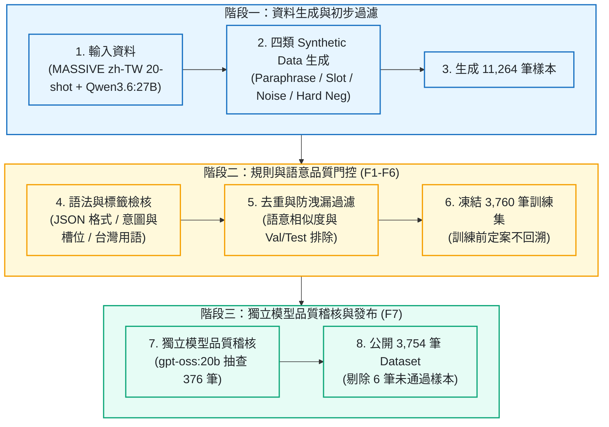
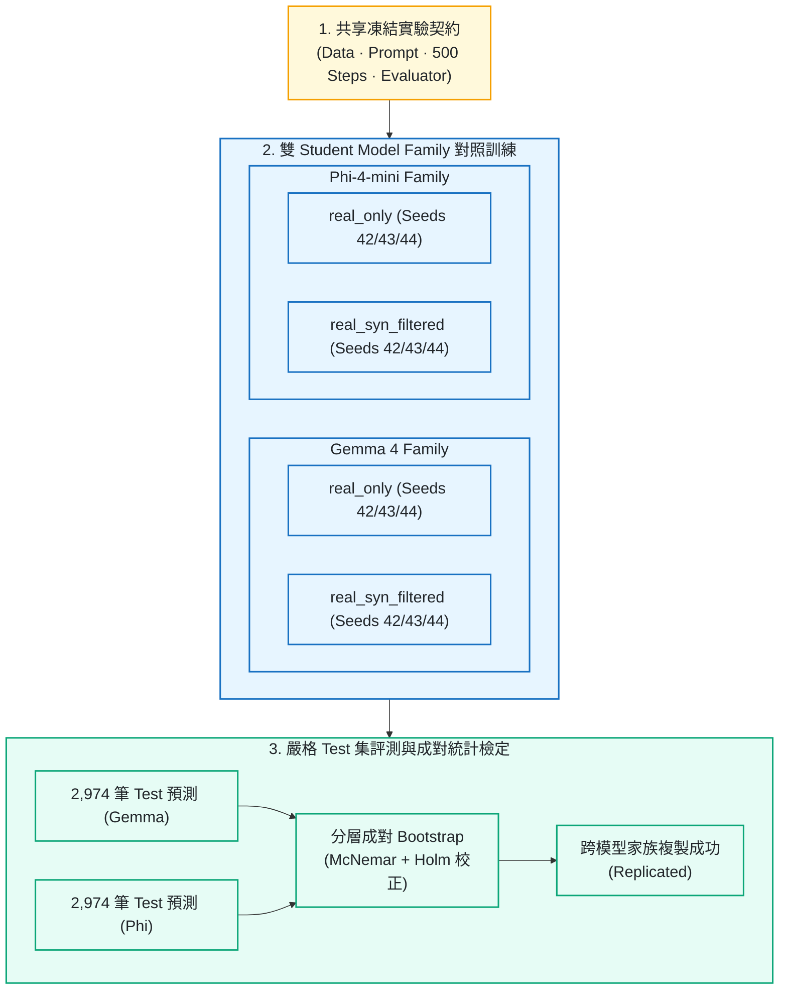

# FormosaNLU — Synthetic Data Distillation for Low-resource NLU

[](https://github.com/kuotunyu/FormosaNLU-Synth/releases/tag/v1.2.1)
[](https://huggingface.co/datasets/steven0226/formosa-nlu-synth-v1)
[](https://huggingface.co/steven0226/gemma-4-e4b-formosanlu-lora)
[](https://doi.org/10.5281/zenodo.21767493)
[](LICENSE)

以本機 open-weight teacher 生成與過濾 synthetic data，並於 20-shot MASSIVE `zh-TW` 上驗證改善 intent classification、slot filling 與 strict JSON output 之成效。效果已於 Gemma 與 Phi-4-mini 兩個 student model families 上以相同之 paired contract 完成複製。

| 核心證據 | 結果說明 |
| --- | --- |
| **Gemma (3 paired seeds)** | intent accuracy **+4.14 pp**；joint exact match **+3.86 pp** |
| **Phi-4-mini replication** | intent accuracy **+5.09 pp**；joint exact match **+4.71 pp** |
| **Local-first pipeline** | **11,264** generated ➔ **3,760** frozen primary；單張 RTX 4090；**$0 API spend** |


> **專案已完成**。GitHub、Hugging Face Dataset、Gemma LoRA adapter 與 Zenodo source archive 均已公開，並通過匿名下載、hash 與 citation 驗證。

---

## 公開產物

| 產物類型 | 位置 | 驗證狀態 |
| --- | --- | --- |
| Source、pipeline、reports | [GitHub](https://github.com/kuotunyu/FormosaNLU-Synth) | Public；Contributors 僅 `kuotunyu` |
| v1.2.1 immutable source archive | [Zenodo](https://zenodo.org/records/21767493) | Public；version DOI [`10.5281/zenodo.21767493`](https://doi.org/10.5281/zenodo.21767493) |
| 3,754-row F1–F7 corpus | [Hugging Face Dataset](https://huggingface.co/datasets/steven0226/formosa-nlu-synth-v1) | Public；Dataset Viewer 與匿名載入通過 |
| Filtered seed-42 LoRA | [Hugging Face Model](https://huggingface.co/steven0226/gemma-4-e4b-formosanlu-lora) | Public；PEFT config、686 tensors 與 SHA-256 通過 |
| English technical report | [LaTeX source 與 build 說明](paper/README.md) | Evidence-bounded technical report；尚未 peer review |

```python
from datasets import load_dataset

dataset = load_dataset("steven0226/formosa-nlu-synth-v1")
print(dataset["train"].num_rows)  # 3754
```

LoRA 使用方式見 [Model Card](https://huggingface.co/steven0226/gemma-4-e4b-formosanlu-lora)；匿名發布稽核見 [`m13_publication.json`](reports/m13_publication.json)。

---

## 實務推論範例與格式對比

以下為同一台 RTX 4090、同一份 decoding contract 之真實輸出：

**輸入：`播放周杰倫`**

```jsonc
// base model — 意圖正確，但鍵名誤用 "slot"
{"intent": "play_music", "slots": [{"slot": "artist_name", "value": "周杰倫"}]}

// filtered adapter
{"intent":"play_music","slots":[{"type":"artist_name","value":"周杰倫"}]}
```

同一組五句中，base model 為 0/5，adapter 達成 **5/5 valid JSON**；差異在於 intent 辨識與穩定遵守 JSON Schema 的能力。

<details>
<summary><strong>查看第二個輸出與比較邊界</strong></summary>

**輸入：`台北明天會不會下雨`**

```json
{"intent":"weather_query","slots":[{"type":"place_name","value":"台北"},{"type":"date","value":"明天"}]}
```

Adapter 也把 base 誤判為 `timeofday` 的「明天」修正為 `date`。兩邊 prompt 刻意不同：base 使用含合法 labels 的 zero-shot catalog prompt，adapter 使用 frozen SFT prompt。

</details>

完整五句、latency 與 adapter tree SHA-256 見 [`m11_demo_evidence.json`](reports/m11_demo_evidence.json)。

---

## 方法總覽

實驗使用 MASSIVE `zh-TW` (60 intents、55 slot types) 之 frozen 20-shot split；`qwen3.6:27b` teacher、`google/gemma-4-E4B-it` / `microsoft/Phi-4-mini-instruct` QLoRA students 與 `gpt-oss:20b` judge 分屬不同 model families。所有 primary results 均來自未進入訓練之 2,974-row Test；本機 RTX 4090 執行，API spend **$0**。

### 1. 資料產製與品質控管



<details>
<summary><strong>F1–F7 檢查項目對照</strong></summary>

| Audit ID | 實際檢查內容 |
| --- | --- |
| F1 | JSON 可解析、欄位與型別正確 |
| F2 | intent 與 slot labels 屬於 frozen label set |
| F3 | slot values 確實出現在句子中 |
| F4 | 繁體中文與台灣用語符合規則 |
| F5 | 去除重複、過近與極端離群樣本 |
| F6 | 排除接近 validation / Test 的內容，只用於刪除、不用於挑選 |
| F7 | 不同 model family 的獨立抽樣稽核，只影響公開 Dataset |

完整 thresholds 與拒絕碼見 [`docs/DESIGN.md`](docs/DESIGN.md)。

</details>

### 2. 成對實驗與跨模型驗證



<details>
<summary><strong>查看 publication static pipeline figure</strong></summary>


</details>

<details>
<summary><strong>執行互動式 base / adapter 比較介面</strong></summary>

```bash
uv sync --extra demo
python -m scripts.demo       # real model
python -m scripts.demo --mock
```

</details>

---

## 實驗結果與評測報告

<details>
<summary><strong>查看 seed-42 primary matrix 與差距補回率</strong></summary>

### Seed-42 primary 實驗矩陣

| Group | Training data | intent acc | intent macro-F1 | slot F1 | exact match | JSON-valid |
| --- | --- | ---: | ---: | ---: | ---: | ---: |
| `zero_shot` | 未訓練 | 10.66% | 23.12% | 0.00% | 8.10% | 17.38% |
| `real_only` | 20-shot real | 73.54% | 75.20% | 62.14% | 49.06% | 98.02% |
| `real_std_aug` | + classical augmentation | 74.31% | 75.59% | 62.58% | 46.81% | 96.23% |
| `real_syn_unfiltered_full` | + 全部 unfiltered synthetic | 75.99% | 76.42% | 65.01% | 51.21% | 97.75% |
| `real_syn_unfiltered_eqn` | + equal-N unfiltered synthetic | 76.03% | 75.59% | 64.37% | 51.01% | 97.95% |
| `real_syn_filtered` | + filtered synthetic | 76.19% | 76.09% | 66.54% | 52.12% | 97.98% |
| `full_real` | 完整 MASSIVE train | 84.53% | 81.65% | 71.58% | 60.66% | 99.73% |

### 差距補回率

以 `real_only` 定義 0%、`full_real` 定義 100%，filtered synthetic primary run 的變化如下：

| Metric | 相較 `real_only` 的絕對變化 | 差距補回率 |
| --- | ---: | ---: |
| Intent accuracy | +2.66 個百分點 | 24.2% |
| Intent macro-F1 | +0.89 個百分點 | 13.8% |
| Slot micro-F1 | +4.40 個百分點 | 46.6% |
| Exact match | +3.06% (3.06 個百分點) | 26.4% |

</details>

### 1. 三種子不確定性分析

`real_only` 與 `real_syn_filtered` 使用完全相同之 frozen data/config，分別在 seeds 42、43、44 訓練與評估；每個 run 都使用完整 2,974-row Test。

| Metric | real-only mean ± SD | filtered mean ± SD | paired Δ mean ± SD | paired Δ 95% CI |
| --- | ---: | ---: | ---: | ---: |
| Intent accuracy | 73.34% ± 0.32% | 77.47% ± 1.14% | +4.14% ± 1.39% | [+0.68%, +7.59%] |
| Intent macro-F1 | 74.55% ± 1.27% | 76.56% ± 0.41% | +2.01% ± 1.48% | [-1.67%, +5.70%] |
| Slot micro-F1 | 62.95% ± 1.18% | 65.86% ± 0.76% | +2.92% ± 1.92% | [-1.86%, +7.69%] |
| Exact match | 48.67% ± 0.65% | 52.52% ± 0.88% | +3.86% ± 0.73% | [+2.03%, +5.68%] |
| JSON-valid rate | 96.54% ± 2.01% | 98.11% ± 0.14% | +1.57% ± 2.02% | [-3.44%, +6.58%] |

95% intervals 使用 Student's t (df=2)；完整逐 seed 報告與原始統計在 [`reports/m9_replicate_summary.md`](reports/m9_replicate_summary.md)。

### 2. 成對統計極限檢定 (Paired Statistical Evidence)

另外使用 frozen row-level predictions 執行 5,000 次 hierarchical paired bootstrap。

| Metric | 平均提升 | Hierarchical bootstrap 95% CI |
| --- | ---: | ---: |
| Intent accuracy | +4.14 個百分點 | **[+2.60, +5.59]** |
| Intent macro-F1 | +2.01 個百分點 | **[+0.35, +3.69]** |
| Slot micro-F1 | +2.92 個百分點 | **[+0.87, +4.68]** |
| Exact match | +3.86 個百分點 | **[+2.75, +4.92]** |

Intent accuracy 與 exact match 另在每個 seed 執行 two-sided exact McNemar test；六項比較經 Holm correction 後全部 `p ≤ 0.00017`。完整方法、input SHA-256 與結果見 [`reports/m14_paired_statistics.md`](reports/m14_paired_statistics.md)。

<details>
<summary><strong>查看 M19 equal-N per-recipe ablation (negative result)</strong></summary>

### Equal-N per-recipe ablation (M19)

M19 將四種 synthetic recipes 進行 leave-one-out，並將每組 synthetic rows 固定為 2,246 筆；連同相同的 1,176 筆 real examples，每組訓練資料均為 3,422 筆。

| Group | 排除的 recipe | intent acc | intent macro-F1 | slot F1 | exact match | exact Δ vs control (pp) | JSON-valid | 達門檻 |
| --- | --- | ---: | ---: | ---: | ---: | ---: | ---: | :---: |
| `abl_all_eqn` | `— (equal-N control)` | 75.99% | 75.51% | 63.61% | 49.50% | +0.00 | 97.34% | 否 |
| `abl_no_paraphrase` | `paraphrase` | 74.14% | 74.72% | 64.09% | 50.00% | +0.50 | 96.54% | 否 |
| `abl_no_slot_substitution` | `slot_substitution` | 77.14% | 77.11% | 65.60% | 51.51% | +2.02 | 96.40% | 否 |
| `abl_no_noise_codeswitch` | `noise_codeswitch` | 73.47% | 73.03% | 63.84% | 48.76% | -0.74 | 96.47% | 否 |
| `abl_no_hard_negative` | `hard_negative` | 76.19% | 76.23% | 64.69% | 50.81% | +1.31 | 97.24% | 否 |

詳細說明見 [`reports/m19_ablation.json`](reports/m19_ablation.json) 與 [`docs/M19_ABLATION_PROTOCOL.md`](docs/M19_ABLATION_PROTOCOL.md)。

</details>

### 3. 跨 Student Family 複製證明

M15 使用第二個 student family (Phi-4-mini) 重跑完全相同之 paired contract：

| Metric | Gemma Δ [95% CI] | Phi Δ [95% CI] | 兩個 family 的 CI 都 > 0 |
| --- | ---: | ---: | :---: |
| `intent_accuracy` | +4.14 [+2.60, +5.59] | +5.09 [+1.83, +9.02] | 通過 |
| `intent_macro_f1` | +2.01 [+0.35, +3.69] | +3.36 [+0.98, +5.56] | 通過 |
| `slot_micro_f1` | +2.92 [+0.87, +4.68] | +1.80 [+0.29, +3.19] | 通過 |
| `exact_match` | +3.86 [+2.75, +4.92] | +4.71 [+1.36, +7.59] | 通過 |
| `json_valid_rate` | +1.57 [-0.01, +3.77] | +1.77 [+1.05, +2.63] | 未通過 |

兩項預先登記之 primary metrics 均通過驗證。詳細數據見 [`reports/m15_cross_model_replication.md`](reports/m15_cross_model_replication.md)。

---

## Filter Pipeline 效益評估

Seed 42 下，3,760-row filtered corpus 相較 unfiltered-full / equal-N unfiltered，intent accuracy 分別高 0.20 / 0.17 pp、slot F1 高 1.53 / 2.17 pp、exact match 高 0.91 / 1.11 pp。


F1-F6 最終保留 3,760 / 11,264 rows (33.38%)。最大損失為 4,596 筆 near-duplicates，揭露了 pilot 未發現之 corpus-scale mode collapse。


---

## 算力成本與可重現性

Primary GPU path 於單張 RTX 4090 上耗時 **14.440 h**；包含所有輔助實驗，本機總耗時為 **42.412 h**，API spend 為 **$0**。

<details>
<summary><strong>查看完整 GPU 時數與能量上限帳本</strong></summary>

| Phase | GPU wall-clock | 證據來源 |
| --- | ---: | --- |
| Synthetic generation | **4.073 h** | `reports/generation_report.json` |
| Primary training (seed 42) | **6.540 h** | `runs/m9_batch_report.json` |
| Trained evaluation (seed 42) | **2.777 h** | `results/m9_eval_batch_report.json` |
| Zero-shot evaluation | **1.050 h** | M8 report |
| **Measured primary core total** | **14.440 h** | 不含 extra seeds、F7 與 robustness |
| Auxiliary tasks total | **27.972 h** | F7 + M11 + extra seeds + robustness + M15 + M16 + M19 |
| **Local total** | **42.412 h** | 所有本機 GPU 階段 |
| **API spend** | **$0** | 所有模型均在本機執行 |

資源帳本位於 [`reports/m12_resource_ledger.json`](reports/m12_resource_ledger.json)。

</details>

---

## 魯棒性測試 (Robustness Probe)

包含 8,922 筆測試資料，涵蓋 typo、code-switching 與 ASR-like noise。

### 三種子 Paired Delta 評測

**Gemma 4 E4B** (seeds 42–44)

| Metric | Mean Δ (百分點) | Sample SD |
| --- | ---: | ---: |
| `intent_accuracy` | +3.63 | 1.72 |
| `intent_macro_f1` | +2.11 | 2.19 |
| `slot_micro_f1` | +2.75 | 2.76 |
| `exact_match` | +3.58 | 2.05 |
| `json_valid_rate` | +1.49 | 2.35 |

**Phi-4-mini** (seeds 42–44)

| Metric | Mean Δ (百分點) | Sample SD |
| --- | ---: | ---: |
| `intent_accuracy` | +6.22 | 3.46 |
| `intent_macro_f1` | +4.69 | 2.73 |
| `slot_micro_f1` | +3.73 | 1.23 |
| `exact_match` | +6.98 | 3.29 |
| `json_valid_rate` | +1.83 | 0.93 |

詳細數據見 [`reports/m16_robustness_summary_gemma.md`](reports/m16_robustness_summary_gemma.md)。

---

## 重現步驟

```bash
# 1. 建立環境
uv sync --extra demo
python -m scripts.check_env

# 2. 建立或驗證 split manifest
python -m src.data.freeze_split
python -m src.data.freeze_split --verify

# 3. 執行推廣與驗證 gate
python -m scripts.check_gates
```

`scripts.check_gates` 會自動驗證 ruff, pytest, verify_readme, verify_contributors 與 verify_closeout。

---

## 論文與資料集引用

```bibtex
@software{kuotunyu_formosanlu_synth_2026,
  author  = {kuotunyu},
  title   = {FormosaNLU Synthetic Data Distillation for Traditional Chinese (Taiwan) NLU},
  year    = {2026},
  version = {1.2.1},
  doi     = {10.5281/zenodo.21767493},
  url     = {https://doi.org/10.5281/zenodo.21767493}
}
```

---

## 授權說明

| 產物類型 | License 條款 |
| --- | --- |
| 本 repository 程式碼 | MIT ([LICENSE](LICENSE)) |
| MASSIVE `zh-TW` seed data | CC BY 4.0 |
| Teacher, judge 與 Gemma student weights | Apache-2.0 |
| Phi-4-mini replication model weights | MIT |
| Synthetic dataset | 詳見 [`docs/data_card.md`](docs/data_card.md) |
| LoRA adapter | Apache-2.0 |
