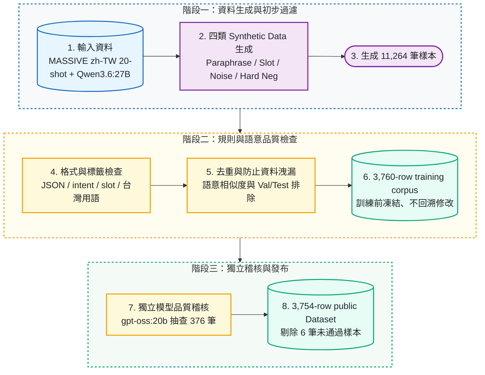

# FormosaNLU — Synthetic Data Distillation for Low-resource NLU

[](https://doi.org/10.5281/zenodo.21879133)
[](https://huggingface.co/datasets/steven0226/formosa-nlu-synth-v1)
[](https://huggingface.co/steven0226/gemma-4-e4b-formosanlu-lora)
[](LICENSE)

每個意圖只有最多 20 句標註資料時，很難訓練出聽得懂繁體中文（台灣）指令的小模型；本專案用一台本機電腦上的開源大模型自動產生並過濾訓練句子，實測能讓小模型更準確地判斷使用者意圖、抓出關鍵資訊，並輸出格式正確的 JSON。

> **TL;DR** — A local open-weight teacher generates and filters synthetic zh-TW NLU data. Added to a 20-shot MASSIVE split, it lifts intent accuracy by +4.14 pp and exact match by +3.86 pp on a Gemma student (3 paired seeds), and the gain replicates on Phi-4-mini. One RTX 4090, $0 API spend.


上圖是 seed 42 的六組對照；下表是 `real_only`（只用 20-shot 真實資料）對 `real_syn_filtered`（再加入過濾後合成資料）在 seeds 42/43/44 的成對比較，每次都用未參與訓練的 2,974 筆 Test。

| Student model（各 3 個 seeds） | Intent accuracy | Exact match（intent 與 slots 全對） |
| --- | ---: | ---: |
| Gemma 4 E4B | 73.34% → 77.47%（**+4.14 pp**，95% CI [+2.60, +5.59]） | 48.67% → 52.52%（**+3.86 pp**，95% CI [+2.75, +4.92]） |
| Phi-4-mini | **+5.09 pp**，95% CI [+1.83, +9.02] | **+4.71 pp**，95% CI [+1.36, +7.59] |

- **全程在本機完成**：teacher 生成 **11,264** 筆，七道過濾後留下 **3,760** 筆用於訓練；單張 RTX 4090，API 花費 **$0**。
- **公開產物**：[GitHub v1.2.2 release](https://github.com/kuotunyu/FormosaNLU-Synth/releases/tag/v1.2.2) · [Hugging Face Dataset（3,754-row）](https://huggingface.co/datasets/steven0226/formosa-nlu-synth-v1) · [Gemma LoRA](https://huggingface.co/steven0226/gemma-4-e4b-formosanlu-lora) · [Phi-4-mini LoRA](https://huggingface.co/steven0226/phi-4-mini-formosanlu-lora) · [原始碼封存 DOI](https://doi.org/10.5281/zenodo.21879133) · [English technical report](https://doi.org/10.5281/zenodo.21879155)（尚未 peer review）

```python
from datasets import load_dataset

dataset = load_dataset("steven0226/formosa-nlu-synth-v1")
print(dataset["train"].num_rows)  # 3754
```

```bash
uv sync --extra demo
python -m scripts.demo --mock   # 不載入模型，先看 base / adapter 比較介面
python -m scripts.demo          # 載入真實模型與 LoRA adapter
```

LoRA 使用方式見 [Model Card](https://huggingface.co/steven0226/gemma-4-e4b-formosanlu-lora)；完整重現步驟見下方「[重現](#重現)」。

## 方法

以 MASSIVE `zh-TW`（60 intents、55 slot types）的 20-shot split 為起點，本機 `qwen3.6:27b` teacher 用四種方式生成句子，經規則與語意檢查後才進入訓練；student 是 `google/gemma-4-E4B-it` 與 `microsoft/Phi-4-mini-instruct` 的 QLoRA，獨立稽核用 `gpt-oss:20b`，三個角色來自不同 model family。split 在生成前就固定，Test 只用來刪除過於相似的合成句，不用來挑選。



七道過濾各檢查什麼、成對實驗的流程圖與實驗設定細節見 [`docs/method.md`](docs/method.md)。

## 結果

### 兩個 student family 的成對比較

兩個 family 用相同的資料、prompt、訓練設定與 evaluator；Δ 是 `real_syn_filtered` 減 `real_only` 的百分點，CI 來自 5,000 次 hierarchical paired bootstrap。

| Metric | Gemma Δ [95% CI] | Phi Δ [95% CI] | 兩個 family 的 CI 都 > 0 |
| --- | ---: | ---: | :---: |
| `intent_accuracy` | +4.14 [+2.60, +5.59] | +5.09 [+1.83, +9.02] | ✅ |
| `intent_macro_f1` | +2.01 [+0.35, +3.69] | +3.36 [+0.98, +5.56] | ✅ |
| `slot_micro_f1` | +2.92 [+0.87, +4.68] | +1.80 [+0.29, +3.19] | ✅ |
| `exact_match` | +3.86 [+2.75, +4.92] | +4.71 [+1.36, +7.59] | ✅ |
| `json_valid_rate` | +1.57 [-0.01, +3.77] | +1.77 [+1.05, +2.63] | ❌ |

兩項預先登記的主要指標（intent accuracy、exact match）在兩個 family 都通過，報告結論為 `replicated_across_student_families`；兩個 family 分開統計、**不 pooling**。Gemma 另在每個 seed 做 two-sided exact McNemar test，六項比較經 Holm correction 後全部 `p ≤ 0.00017`。

### 離「用完整真實訓練集」還差多少（seed 42）

頁首的圖就是 seed 42 的六組對照。以 `real_only` 為 0%、`full_real`（完整 MASSIVE train 的上限）為 100%，`real_syn_filtered` 補回的差距如下；七行主表（含未訓練的 `zero_shot`）見 [`docs/results.md`](docs/results.md)。

| Metric | 相較 `real_only` 的絕對變化 | 差距補回率 |
| --- | ---: | ---: |
| Intent accuracy | +2.66 個百分點 | 24.2% |
| Intent macro-F1 | +0.89 個百分點 | 13.8% |
| Slot micro-F1 | +4.40 個百分點 | 46.6% |
| Exact match | +3.06% (3.06 個百分點) | 26.4% |

過濾後的 3,760 筆相較全部 unfiltered／等量 unfiltered，intent accuracy 高 0.20 / 0.17 pp、slot F1 高 1.53 / 2.17 pp、exact match 高 0.91 / 1.11 pp。

### 其他發現

- **擾動測試也有改善**：把 Test 改寫成 colloquial、lexical、ASR-like noise 三種版本共 8,922 筆，seeds 42–44 的成對平均 exact match 為 +3.58 pp（Gemma）、+6.98 pp（Phi-4-mini）。
- **分不出單一生成方式的貢獻**：輪流拿掉四種生成方式之一、每組固定 2,246 筆合成資料後，exact match 的差異都低於預先登記的 2.5 percentage points 門檻；這是 seed 42（n=1）的比較，因此不做單一 recipe 的 causal claim。
- **過濾揭露大量重複**：七道過濾保留 3,760 / 11,264 筆（33.38%），最大的損失是 4,596 筆 near-duplicates。
- **成本**：主要流程 **14.440 h**、含所有輔助實驗共 **42.412 h** 的單張 RTX 4090 時間。

完整表格（三個 seeds 的平均與標準差、逐 recipe ablation、擾動測試、GPU 時數）見 [`docs/results.md`](docs/results.md)。

### 實際輸出範例

輸入 `播放周杰倫`，同一台 RTX 4090、同樣的 decoding 設定：

```jsonc
// base model — 意圖正確，但鍵名誤用 "slot"
{"intent": "play_music", "slots": [{"slot": "artist_name", "value": "周杰倫"}]}

// filtered adapter
{"intent":"play_music","slots":[{"type":"artist_name","value":"周杰倫"}]}
```

同一組五句中，**base model 0/5**，adapter 達成 **5/5 valid JSON**。第二個範例與五句原始輸出見 [`docs/results.md`](docs/results.md#實務推論範例) 與 [`reports/m11_demo_evidence.json`](reports/m11_demo_evidence.json)。

## 適用範圍與限制

- 只在 MASSIVE `zh-TW` 的 20-shot 設定與兩個 student family 上驗證，不宣稱可推廣至任意 model、任務或 Dataset。
- 三個 seeds 只補在 `real_only` 與 `real_syn_filtered`；六組對照、差距補回率與 filtered 對 unfiltered 的小幅差距都來自 seed 42 單次訓練，沒有 CI。
- 每組只有 3 個 seeds。`json_valid_rate` 在 Gemma 的 CI 含 0（[-0.01, +3.77]），不列為已確認的改善；若改用 Student's t（df=2）區間，intent accuracy 與 exact match 仍高於 0，但 macro-F1、slot F1 的區間含 0（見 [`docs/results.md`](docs/results.md)）。
- 輸出範例的兩邊 prompt 刻意不同：base 使用含合法 labels 的 zero-shot catalog prompt，adapter 使用訓練時的固定 SFT prompt；五句只是示範，正式數字以 2,974 筆 Test 為準。
- 獨立稽核只抽查 376 筆；random stratum 的觀察漏檢率為 **6.0%**（50 筆樣本，區間仍寬）。稽核只從公開 Dataset 剔除 6 筆，不回頭修改已用於訓練的 3,760 筆。
- 三種擾動是 deterministic 的規則改寫，不等同真實 ASR 或自然 code-switching 分布。
- 重現步驟驗證的是環境、split manifest 與報告數字；沒有在乾淨環境重跑生成與訓練（見 [`reports/m18_reproduce_check.md`](reports/m18_reproduce_check.md)）。Technical report 尚未 peer review。

## 重現

```bash
# 1. 建立環境
uv sync --extra demo
python -m scripts.check_env

# 2. 建立或驗證 split manifest
python -m src.data.freeze_split
python -m src.data.freeze_split --verify

# 3. 執行所有檢查
python -m scripts.check_gates
```

`scripts.check_gates` 會依序執行七道檢查：`ruff`、`pytest`、`scripts.verify_readme`、`scripts.verify_public_paths`、`scripts.verify_contributors`、`scripts.verify_reproduce`、`scripts.verify_closeout`；任何一項失敗都會阻止推送。其中 `scripts.verify_readme` 會把本頁與 `docs/results.md` 的主要數字對照 `reports/` 內的原始檔。

## 引用

```bibtex
@software{kuotunyu_formosanlu_synth_2026,
  author  = {kuotunyu},
  title   = {FormosaNLU Synthetic Data Distillation for Traditional Chinese (Taiwan) NLU},
  year    = {2026},
  version = {1.2.2},
  doi     = {10.5281/zenodo.21879133},
  url     = {https://doi.org/10.5281/zenodo.21879133}
}
```

v1.2.2 immutable software archive：<https://zenodo.org/records/21879133>；all-versions concept DOI：<https://doi.org/10.5281/zenodo.21767492>。English technical report 另以 Technical note DOI <https://doi.org/10.5281/zenodo.21879155> 保存（<https://zenodo.org/records/21879155>）。Dataset 與 Model 仍依各自的 license 與 card 為準。

## 授權說明

- 本 repository 程式碼：MIT（[LICENSE](LICENSE)；第三方聲明見 [`THIRD_PARTY_NOTICES.md`](THIRD_PARTY_NOTICES.md)）
- MASSIVE `zh-TW` seed data：CC BY 4.0；synthetic dataset 詳見 [`docs/data_card.md`](docs/data_card.md)
- Teacher、judge 與 Gemma student weights，以及 Gemma LoRA adapter：Apache-2.0
- Phi-4-mini base weights 與公開 seed-42 LoRA adapter：MIT；base model notices 仍適用

## 延伸閱讀

- [`docs/method.md`](docs/method.md)：實驗設定、七道過濾說明、成對實驗流程圖
- [`docs/results.md`](docs/results.md)：完整結果表、ablation、擾動測試、GPU 時數、公開產物驗證狀態
- [`docs/REVIEWER_PATH.md`](docs/REVIEWER_PATH.md)：五分鐘審閱路線
- [`docs/DESIGN.md`](docs/DESIGN.md)、[`docs/DECISIONS.md`](docs/DECISIONS.md)：設計規格與決策紀錄
- [`docs/data_card.md`](docs/data_card.md)：資料來源、授權與使用限制
- [`reports/m14_paired_statistics.md`](reports/m14_paired_statistics.md)、[`reports/m15_cross_model_replication.md`](reports/m15_cross_model_replication.md)：統計檢定原始報告
