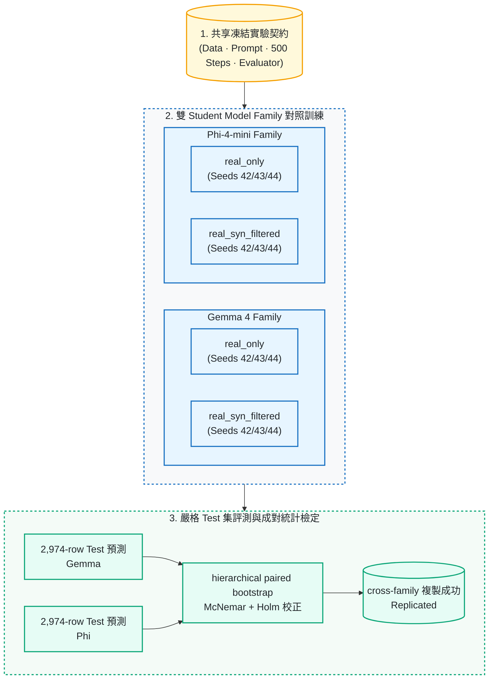

# 方法細節

本頁收錄從 [README](../README.md) 移出的方法說明與圖表；主要結果與限制仍以 README 為入口，完整數字表見 [`docs/results.md`](results.md)。

## 實驗設定

實驗使用 MASSIVE `zh-TW` (60 intents、55 slot types) 之 frozen 20-shot split；`qwen3.6:27b` teacher、`google/gemma-4-E4B-it` / `microsoft/Phi-4-mini-instruct` QLoRA students 與 `gpt-oss:20b` judge 分屬不同 model families。所有 primary results 均來自未進入訓練之 2,974-row Test；本機 RTX 4090 執行，API spend **$0**。

六組訓練資料（`real_only`、`real_std_aug`、`real_syn_unfiltered_full`、`real_syn_unfiltered_eqn`、`real_syn_filtered`、`full_real`）加上未訓練的 `zero_shot`，組成 README 的七行主表。完整設計、thresholds 與拒絕碼見 [`docs/DESIGN.md`](DESIGN.md) 與 [`docs/DESIGN_PHASE2.md`](DESIGN_PHASE2.md)；設計決策的理由見 [`docs/DECISIONS.md`](DECISIONS.md)。

## 資料產製與品質控管

資料流程圖在 [README 的「方法」一節](../README.md#方法)。靜態版本如下：


### F1–F7 是什麼？

| Audit ID | 實際檢查內容 |
| --- | --- |
| F1 | JSON 可解析、欄位與型別正確 |
| F2 | intent 與 slot labels 屬於 frozen label set |
| F3 | slot values 確實出現在句子中 |
| F4 | 繁體中文與台灣用語符合規則 |
| F5 | 去除重複、過近與極端離群樣本 |
| F6 | 排除接近 validation / Test 的內容，只用於刪除、不用於挑選 |
| F7 | 不同 model family 的獨立抽樣稽核，只影響公開 Dataset |

完整 thresholds 與拒絕碼見 [`docs/DESIGN.md`](DESIGN.md)。

## 成對實驗與跨模型驗證



兩個 student family 使用相同的資料、prompt、訓練設定與 evaluator；`real_only` 與 `real_syn_filtered` 各以 seeds 42、43、44 訓練，每個 run 都在完整 2,974-row Test 上評估。統計方法與 input SHA-256 見 [`reports/m14_paired_statistics.md`](../reports/m14_paired_statistics.md)，跨 family 判準見 [`reports/m15_cross_model_replication.md`](../reports/m15_cross_model_replication.md)。

## 互動式 base / adapter 比較介面

```bash
uv sync --extra demo
python -m scripts.demo       # real model
python -m scripts.demo --mock
```

五句真實輸出、latency 與 adapter tree SHA-256 見 [`reports/m11_demo_evidence.json`](../reports/m11_demo_evidence.json)；兩個輸出範例見 [`docs/results.md`](results.md#實務推論範例)。
