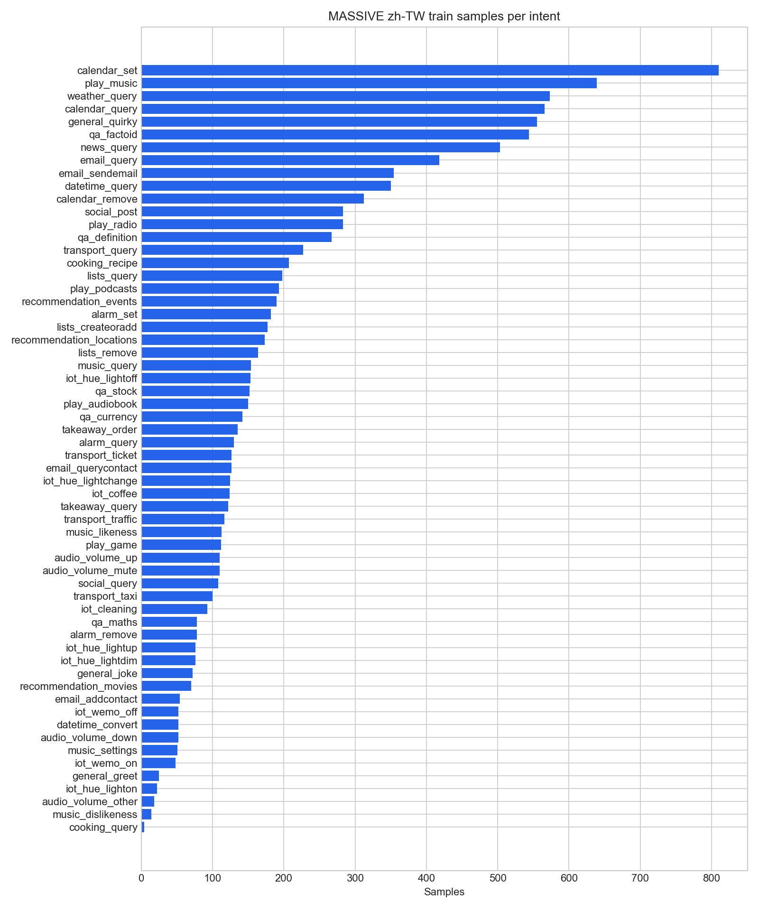
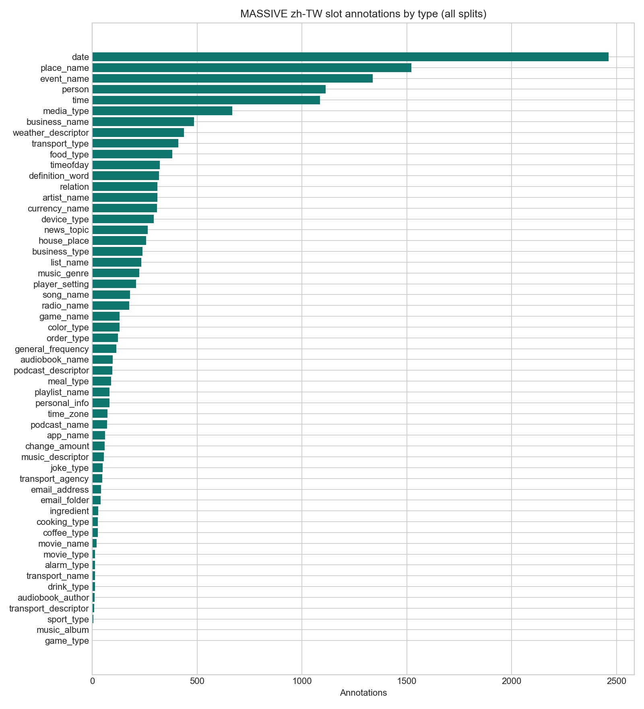

# M1 MASSIVE `zh-TW` data audit

Generated by `python -m src.data.audit`. Raw recomputable values are in
[`m1_data_audit.json`](m1_data_audit.json).

## Source and shape

| Item | Observed |
|---|---:|
| Train | 11,514 |
| Validation | 2,033 |
| Test | 2,974 |
| Total | 16,521 |
| Intents | 60 |
| Slot types | 55 |
| Train samples per intent (min / median / max) | 4 / 128.5 / 810 |

The targeted loader reads only `zh-TW/<split>/0000.parquet` from the immutable
`refs/convert/parquet` revision. Calling `load_dataset("AmazonScience/massive")`
without targeted files is unsafe here: the converted repository exposes only a
`default` config and materializes every locale.

## Annotation and whitespace findings

| Check | Observed |
|---|---:|
| `utt` rows containing whitespace | 1,676 / 16,521 (10.14%) |
| `annot_utt` rows containing whitespace | 11,205 / 16,521 (67.82%) |
| Annotation reconstructs `utt` after normalization | 16,507 / 16,521 (99.92%) |
| Rows containing at least one slot | 10,687 / 16,521 (64.69%) |
| Raw slot value is a contiguous `utt` substring | 15,171 / 15,171 (100.00%) |
| Normalized slot value is a contiguous normalized `utt` substring | 15,159 / 15,171 (99.92%) |

`annot_utt` uses spaces as annotation delimiters (`[type : value]`), while
ordinary `utt` text usually does not use word-level spacing. Groundedness must
therefore share `src/data/normalize.py` across filtering and evaluation; raw
substring matching alone is recorded above but is not the project contract.

## Distribution charts

Both PNGs were opened after generation. Labels, axes, ordering, and scales are
readable; they show a strongly imbalanced intent distribution (4–810 train
samples) and a long-tailed slot distribution dominated by `date` and
`place_name`.

## Interpretation

- The official split sizes match 11,514 / 2,033 / 2,974 exactly.
- The actual 20-shot sample is determined from the frozen manifest; no count is
  assumed before sampling.
- Validation and Test remain real-only. The generator receives IDs exclusively
  from `splits/manifest.json::splits.train_20shot`.
